---
## Front matter
lang: ru-RU
title: Лабораторная работа №1
subtitle: Операционные системы
author:
  - Пашаев Юсиф Юнусович
institute:
  - Российский университет дружбы народов, Москва, Россия
 

## i18n babel
babel-lang: russian
babel-otherlangs: english

## Formatting pdf
toc: false
toc-title: Содержание
slide_level: 2
aspectratio: 169
section-titles: true
theme: metropolis
header-includes:
 - \metroset{progressbar=frametitle,sectionpage=progressbar,numbering=fraction}
 - '\makeatletter'
 - '\beamer@ignorenonframefalse'
 - '\makeatother'
---

# Информация

## Докладчик

:::::::::::::: {.columns align=center}
::: {.column width="70%"}

  * Юсиф Пашаев Юнусович
  * студент НБИбд-02-22
  * Российский университет дружбы народов
 

:::
::::::::::::::

# Вводная часть

## Материалы и методы

- Процессор `pandoc` для входного формата Markdown
- Результирующие форматы
	- `pdf`
	- `html`
- Автоматизация процесса создания: `Makefile`

# Создание презентации

## Процессор `pandoc`

- Pandoc: преобразователь текстовых файлов
- Сайт: <https://pandoc.org/>
- Репозиторий: <https://github.com/jgm/pandoc>

## Формат `pdf`

- Использование LaTeX
- Пакет для презентации: [beamer](https://ctan.org/pkg/beamer)
- Тема оформления: `metropolis`

## Код для формата `pdf`

```yaml
slide_level: 2
aspectratio: 169
section-titles: true
theme: metropolis
```

## Формат `html`

- Используется фреймворк [reveal.js](https://revealjs.com/)
- Используется [тема](https://revealjs.com/themes/) `beige`

## Код для формата `html`

- Тема задаётся в файле `Makefile`

```make
REVEALJS_THEME = beige 
```
# Результаты


# Элементы презентации

## Цели и задачи
- Целью данной работы является приобретение практических навыков установки операционной системы на виртуальную машину, настройки минимально необходимых для дальнейшей работы сервисов.


## Содержание исследования

1. Создаю виртуальную машину .

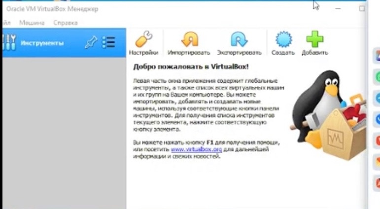{#fig:001 width=90%}

##

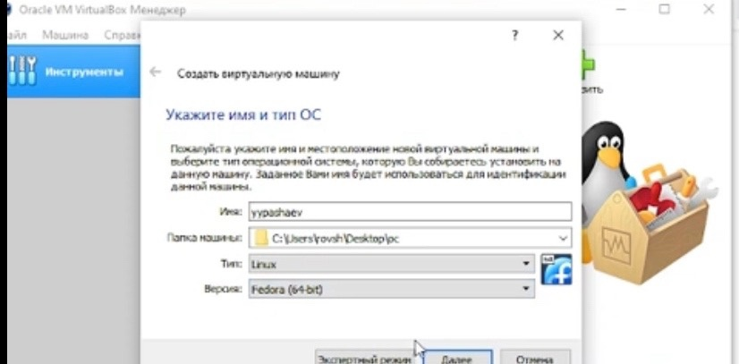{#fig:002 width=90%}

##

2.Задаю конфигурацию жестокого диска -VDI,динамический виртуальный диск

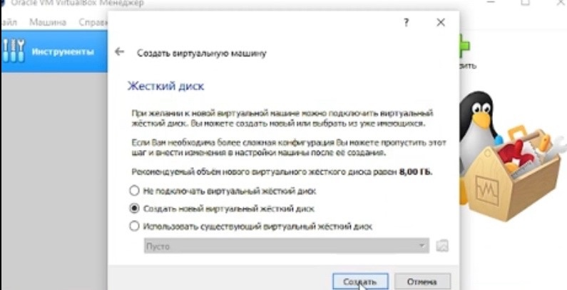{#fig:003 width=90%}

##

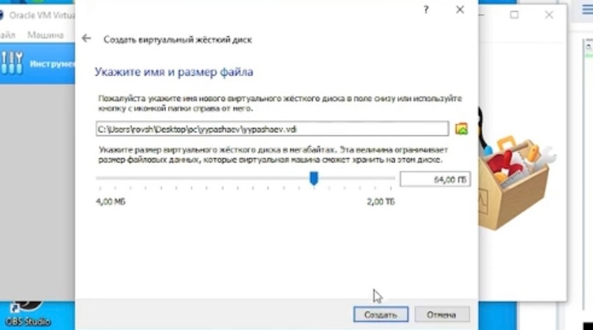{#fig:004 width=90%}

##

3. Добавляю новый привод оптических дисков и  выбираю образ 

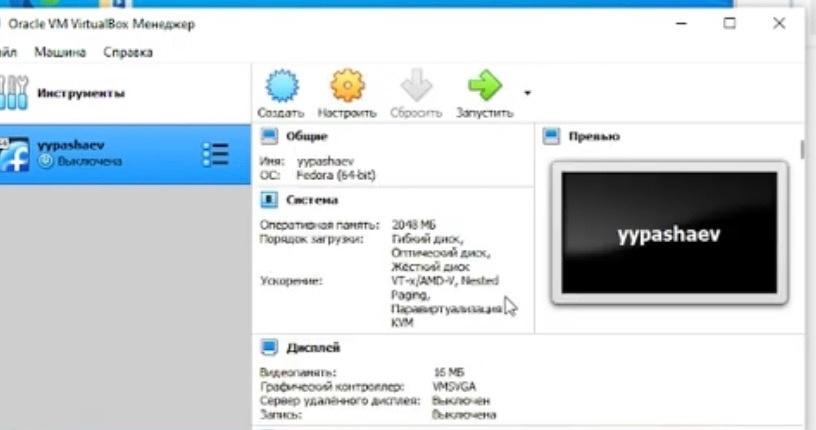{#fig:005 width=90%}

##

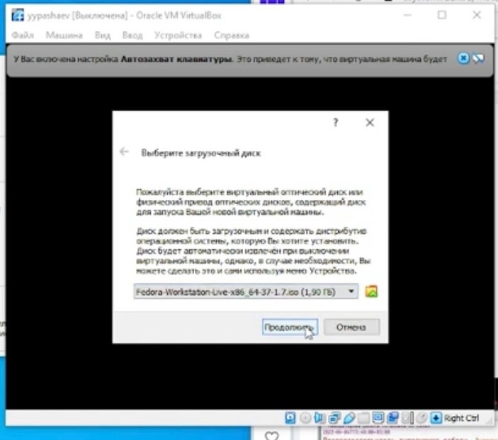{#fig:006 width=90%}

##

4. Запускаю виртуальную машину и выбираю установку системы на жесткий диск. 
Устанавливаю язык для интерфейса и раскладки клавиутуры 

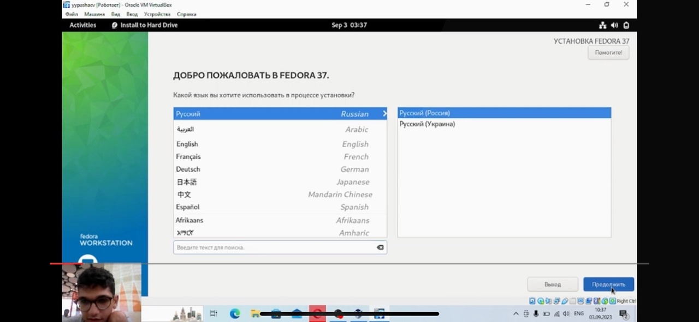{#fig:007 width=90%}

##

5. Указываю параметры установки 

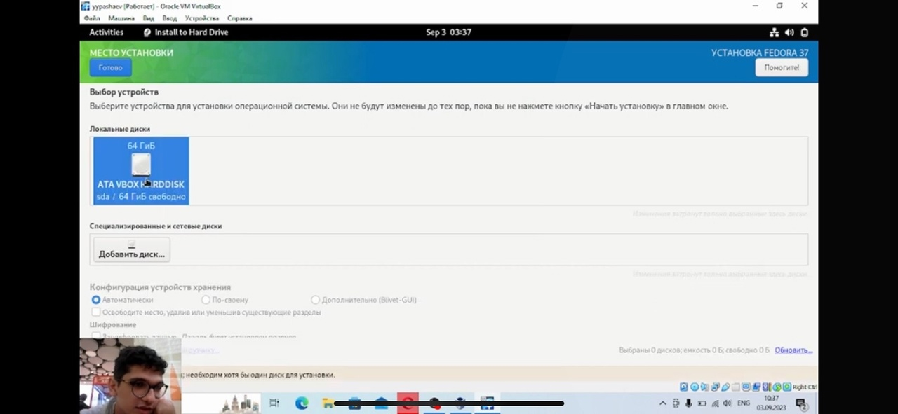{#fig:008 width=90%}

##

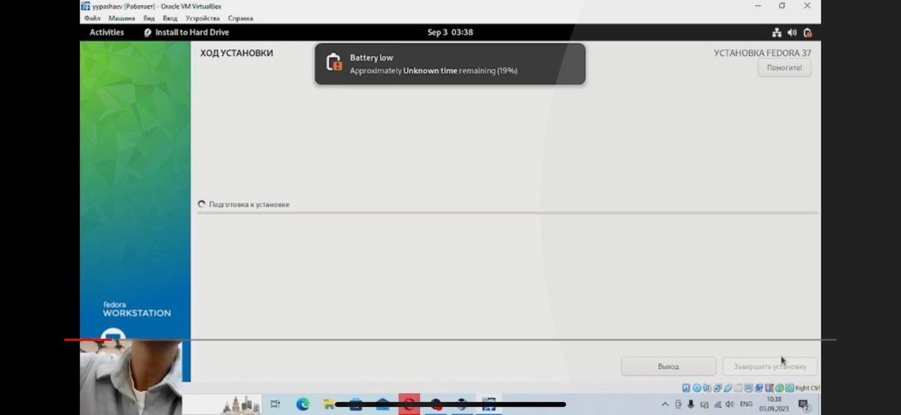{#fig:009 width=90%}

##

6. Создаю пользователя и пароль к нему 

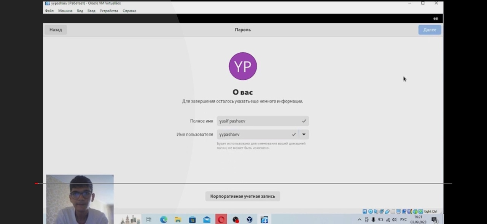{#fig:010 width=90%}

##

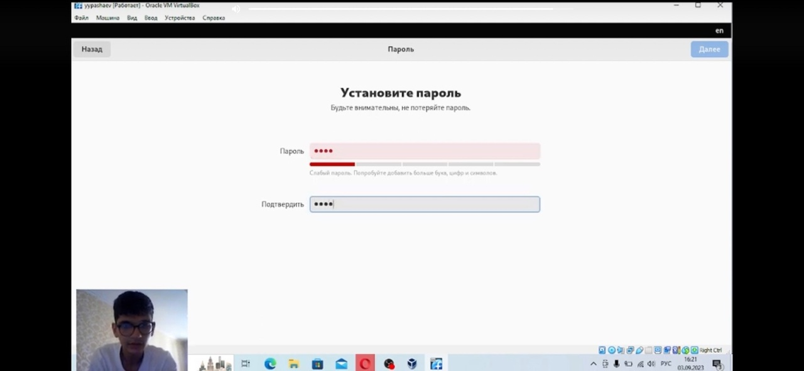{#fig:011 width=90%}

##

7. Открываю консоль.Запускаю терминальный мультиплексор tmux 

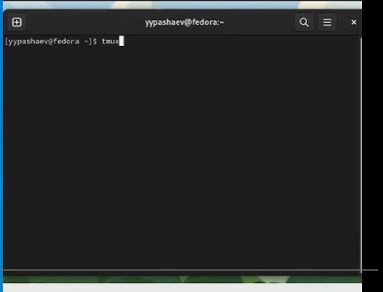{#fig:012 width=90%}

##

8. Установливаю  пакет DKMS 

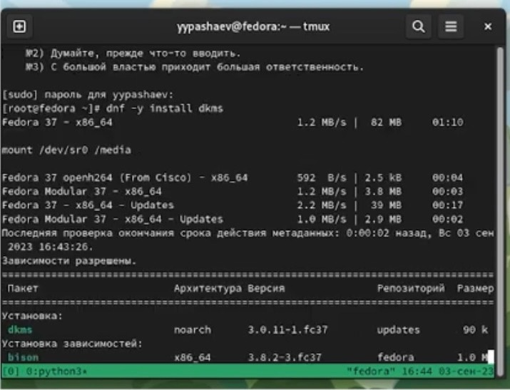{#fig:013 width=90%}

##

9. Подмонтирую диск . Установлю драйвера 
    
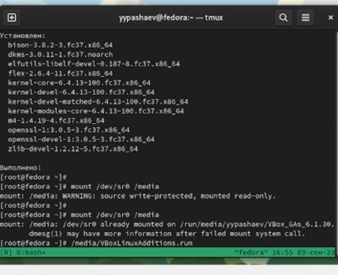{#fig:014 width=90%}

##

10. Перезагружу виртуальную машину 

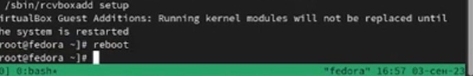{#fig:015 width=90%}

##

11.  Переключитесь на роль супер-пользователя. Установим pandoc 

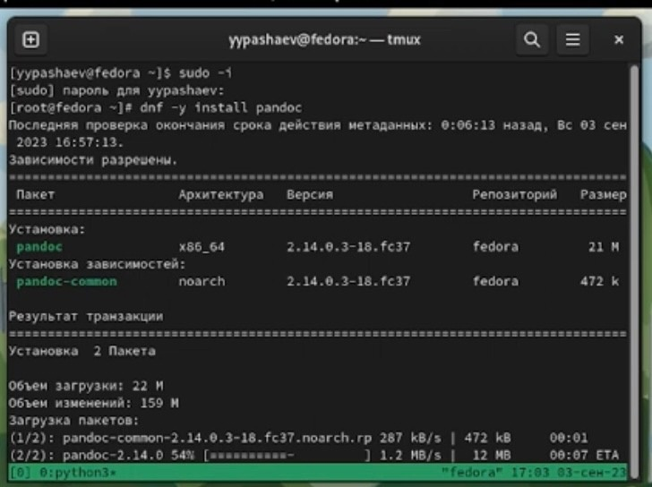{#fig:016 width=90%}

##

12. Установим необходимые расширения 

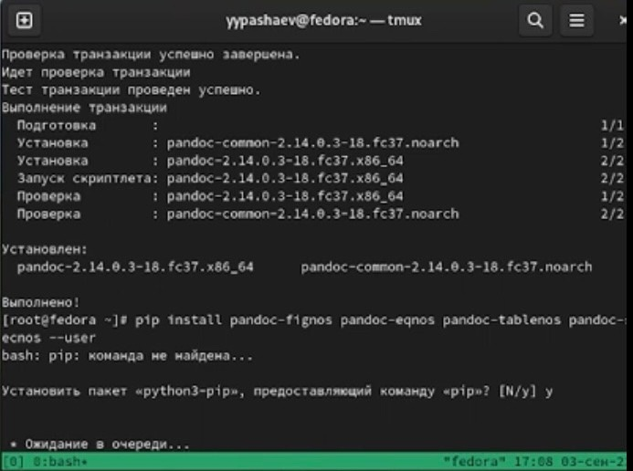{#fig:017 width=90%}

##

13. Установим дистрибутив TeXlive 

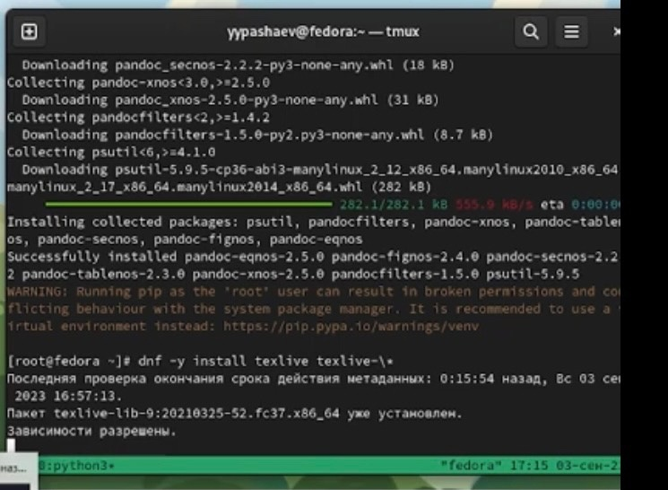{#fig:018 width=90%}

##

14. Получаю информацию  по машине . Версия ядра Linux 

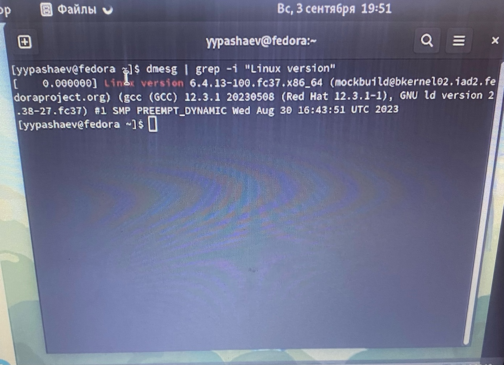{#fig:019 width=90%}

##

15. Частота процессора 

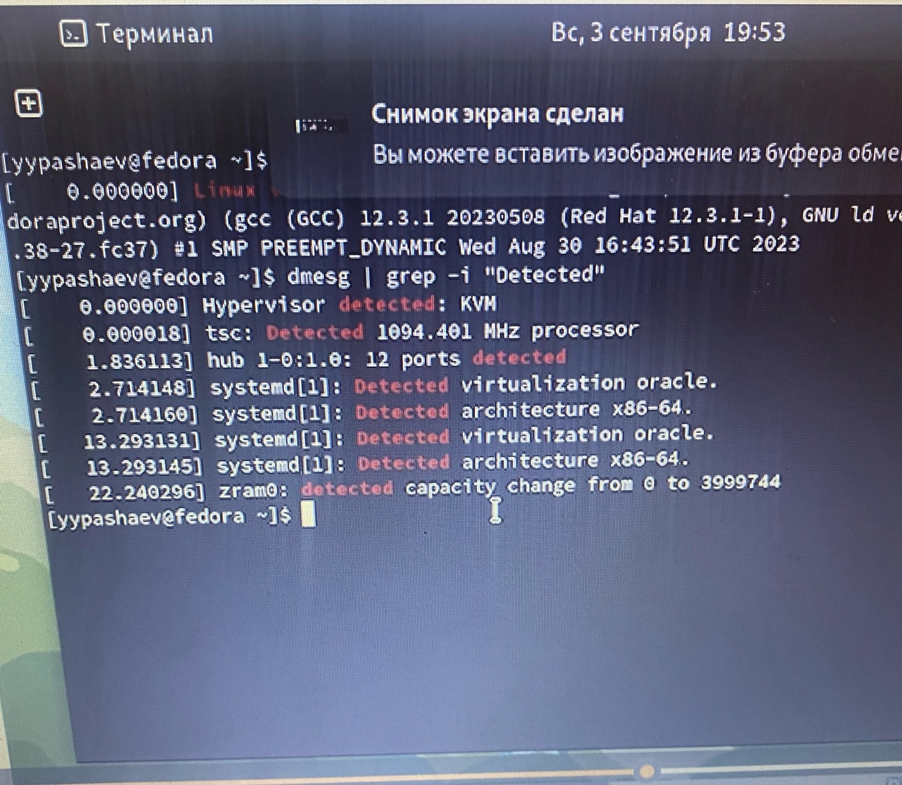{#fig:020 width=90%}

##

16. Модель процессора 

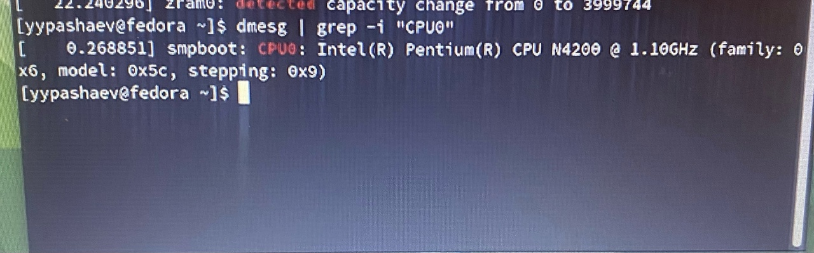{#fig:021 width=90%}

##

17. Объём доступной оперативной памяти 

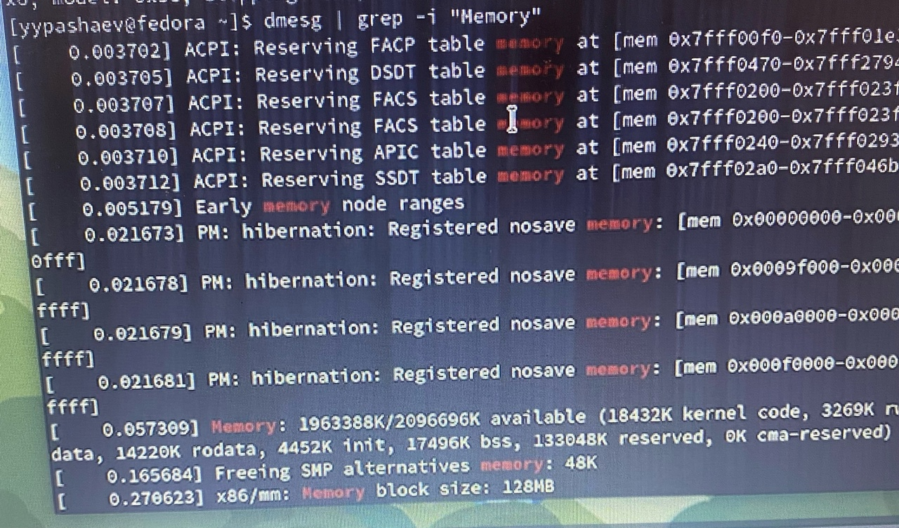{#fig:022 width=90%}

##

18. Тип обнаруженного гипервизора 

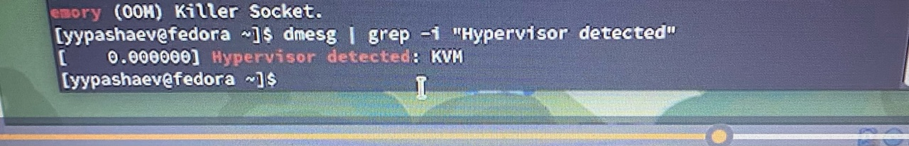{#fig:023 width=90%}

##

19. Тип файловой системы корневого раздела. 

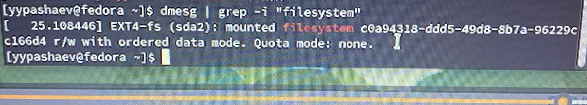{#fig:024 width=90%}

##

## Результаты

приобрел практические навыки установки операционной системы на виртуальную машину, настройки минимально необходимых для дальнейшей работы сервисов.


## Итоговый слайд

- Запоминается последняя фраза. © Штирлиц

:::

