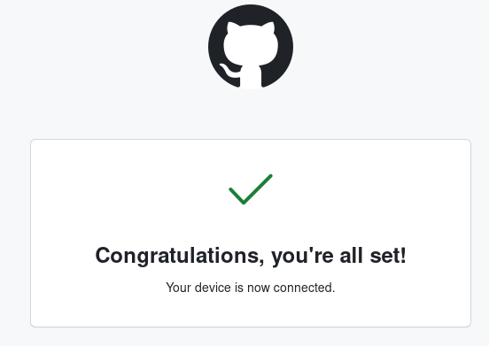

---
## Front matter
title: "Лабораторная работа №2"
subtitle: "Операционные системы"
author: "Пашаев Юсиф Юнусович"

## Generic otions
lang: ru-RU
toc-title: "Содержание"

## Bibliography
bibliography: bib/cite.bib
csl: pandoc/csl/gost-r-7-0-5-2008-numeric.csl

## Pdf output format
toc: true # Table of contents
toc-depth: 2
lof: true # List of figures
lot: true # List of tables
fontsize: 12pt
linestretch: 1.5
papersize: a4
documentclass: scrreprt
## I18n polyglossia
polyglossia-lang:
  name: russian
  options:
	- spelling=modern
	- babelshorthands=true
polyglossia-otherlangs:
  name: english
## I18n babel
babel-lang: russian
babel-otherlangs: english
## Fonts
mainfont: PT Serif
romanfont: PT Serif
sansfont: PT Sans
monofont: PT Mono
mainfontoptions: Ligatures=TeX
romanfontoptions: Ligatures=TeX
sansfontoptions: Ligatures=TeX,Scale=MatchLowercase
monofontoptions: Scale=MatchLowercase,Scale=0.9
## Biblatex
biblatex: true
biblio-style: "gost-numeric"
biblatexoptions:
  - parentracker=true
  - backend=biber
  - hyperref=auto
  - language=auto
  - autolang=other*
  - citestyle=gost-numeric
## Pandoc-crossref LaTeX customization
figureTitle: "Рис."
tableTitle: "Таблица"
listingTitle: "Листинг"
lofTitle: "Список иллюстраций"
lotTitle: "Список таблиц"
lolTitle: "Листинги"
## Misc options
indent: true
header-includes:
  - \usepackage{indentfirst}
  - \usepackage{float} # keep figures where there are in the text
  - \floatplacement{figure}{H} # keep figures where there are in the text
---

# Цель работы

- Изучить идеологию и применение средств контроля версий.
- Освоить умения по работе с git.

# Задание

- Создать базовую конфигурацию для работы с git.
- Создать ключ SSH.
- Создать ключ PGP.
- Настроить подписи git.
- Зарегистрироваться на Github.
- Создать локальный каталог для выполнения заданий по предмету.

# Выполнение лабораторной работы

1. Установим git: (рис. @fig:001).

{#fig:001 width=90%}

2. Установка gh (рис. @fig:002).

{#fig:002 width=90%}

3. Зададим имя и email владельца репозитория (рис. @fig:003).

{#fig:003 width=90%}

4. Создаем ключи ssh по алгоритму rsa с ключём размером 4096 бит: (рис. @fig:004).

{#fig:004 width=90%}

5. Создаем ключи по алгоритму ed25519: (рис. @fig:005).

{#fig:005 width=90%}

6. Генерируем ключ (рис. @fig:006).

{#fig:006 width=90%}

7. Выводим список ключей и копируем отпечаток приватного ключа. копируем сгенерированный PGP ключ в буфер обмена. С его помощью мы создаем GPG ключ (рис. @fig:007).

{#fig:007 width=90%}

8. Используя введёный email, укажим Git применять его при подписи коммитов: (рис. @fig:008).

{#fig:008 width=90%}

9. Настройка gh. Для начала необходимо авторизоваться (рис. @fig:009).

{#fig:009 width=90%}

10. Создание репозитория курса на основе шаблона (рис. @fig:010).

{#fig:010 width=90%}

11. Перейдем в каталог курса и удалим лишние файлы. Создадим необходимые каталоги (рис. @fig:011).

{#fig:011 width=90%}

12. Отправим файлы на сервер 

{#fig:012 width=90%}

{#fig:013 width=90%}

# Выводы

Мы изучили идеологию и применение средств контроля версий, а также освоили умения по работе с git.

# Список литературы{.unnumbered}

::: {#refs}
:::
