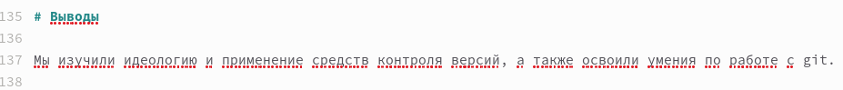

---
## Front matter
lang: ru-RU
title: Лабораторная работа №3
subtitle: Операционные системы
author:
  - Пашаев Юсиф Юнусович
institute:
  - Российский университет дружбы народов, Москва, Россия
 

## i18n babel
babel-lang: russian
babel-otherlangs: english

## Formatting pdf
toc: false
toc-title: Содержание
slide_level: 2
aspectratio: 169
section-titles: true
theme: metropolis
header-includes:
 - \metroset{progressbar=frametitle,sectionpage=progressbar,numbering=fraction}
 - '\makeatletter'
 - '\beamer@ignorenonframefalse'
 - '\makeatother'
---

# Информация

## Докладчик

:::::::::::::: {.columns align=center}
::: {.column width="70%"}

  * Юсиф Пашаев Юнусович
  * студент НБИбд-02-22
  * Российский университет дружбы народов
 

:::
::::::::::::::

# Вводная часть

## Материалы и методы

- Процессор `pandoc` для входного формата Markdown
- Результирующие форматы
	- `pdf`
	- `html`
- Автоматизация процесса создания: `Makefile`

# Создание презентации

## Процессор `pandoc`

- Pandoc: преобразователь текстовых файлов
- Сайт: <https://pandoc.org/>
- Репозиторий: <https://github.com/jgm/pandoc>

## Формат `pdf`

- Использование LaTeX
- Пакет для презентации: [beamer](https://ctan.org/pkg/beamer)
- Тема оформления: `metropolis`

## Код для формата `pdf`

```yaml
slide_level: 2
aspectratio: 169
section-titles: true
theme: metropolis
```

## Формат `html`

- Используется фреймворк [reveal.js](https://revealjs.com/)
- Используется [тема](https://revealjs.com/themes/) `beige`

## Код для формата `html`

- Тема задаётся в файле `Makefile`

```make
REVEALJS_THEME = beige 
```
# Результаты

# Элементы презентации

## Цели и задачи

- Научиться оформлять отчёты с помощью легковесного языка разметки Markdown


## Содержание исследования

1. Заполнил титульный лист .

{#fig:001 width=90%}

##

2. Написал цель работы .

{#fig:002 width=90%}

##

3. Заполнил список заданий .

{#fig:003 width=90%}

##

4. Расписал выполнение работы .

{#fig:004 width=90%}

##

5. Написал вывод .

{#fig:005 width=90%}

##

6. Исользовал команду make я создал отчет ввиде pdf и docx
 файлов .

{#fig:006 width=90%}

##

## Результаты
Научился оформлять отчёты с помощью легковесного языка разметки Markdown


## Итоговый слайд

- Запоминается последняя фраза. © Штирлиц

:::

