---
## Front matter
lang: ru-RU
title: "Лабораторная работа №4"
subtitle: "Операционные системы"
author:
  - Пашаев Юсиф Юнусович
institute:
  - Российский университет дружбы народов, Москва, Россия
  

## i18n babel
babel-lang: russian
babel-otherlangs: english

## Formatting pdf
toc: false
toc-title: Содержание
slide_level: 2
aspectratio: 169
section-titles: true
theme: metropolis
header-includes:
 - \metroset{progressbar=frametitle,sectionpage=progressbar,numbering=fraction}
 - '\makeatletter'
 - '\beamer@ignorenonframefalse'
 - '\makeatother'
---

# Информация

## Докладчик


  * "Пашаев Юсиф Юнусович"
  * студент НБИбд-02-22
  * Российский университет дружбы народов
 

# Вводная часть


# Создание презентации

## Процессор `pandoc`

- Pandoc: преобразователь текстовых файлов
- Сайт: <https://pandoc.org/>
- Репозиторий: <https://github.com/jgm/pandoc>

## Формат `pdf`

- Использование LaTeX
- Пакет для презентации: [beamer](https://ctan.org/pkg/beamer)
- Тема оформления: `metropolis`

## Код для формата `pdf`

```yaml
slide_level: 2
aspectratio: 169
section-titles: true
theme: metropolis
```

## Формат `html`

- Используется фреймворк [reveal.js](https://revealjs.com/)
- Используется [тема](https://revealjs.com/themes/) `beige`

## Код для формата `html`

- Тема задаётся в файле `Makefile`

```make
REVEALJS_THEME = beige 
```
# Результаты

## Получающиеся форматы

- Полученный `pdf`-файл можно демонстрировать в любой программе просмотра `pdf`
- Полученный `html`-файл содержит в себе все ресурсы: изображения, css, скрипты

# Элементы презентации

## Актуальность

- Даёт понять, о чём пойдёт речь
- Следует широко и кратко описать проблему
- Мотивировать свое исследование
- Сформулировать цели и задачи
- Возможна формулировка ожидаемых результатов

## Цели и задачи

- Приобретение практических навыков взаимодействия пользователя с системой по-
средством командной строки


## Содержание исследования

1. Перехожу в каталог /tmp.
 Вывожу на экран содержимое каталога /tmp. Для этого использую команду ls.

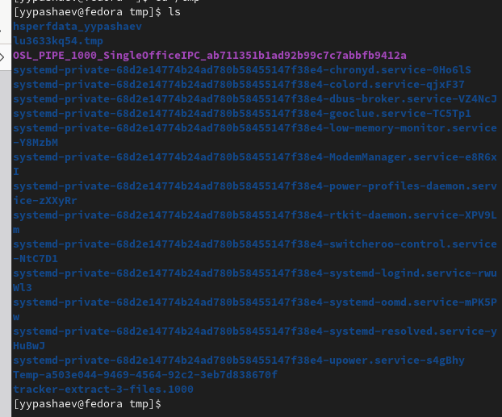{#fig:001 width=90%}

##

2. Определяю., есть ли в каталоге /var/spool подкаталог с именем cron

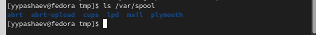{#fig:002 width=90%}

##

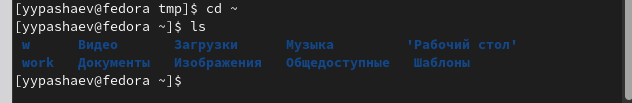{#fig:003 width=90%}

##
3.  Домашнем каталоге создаю новый каталог с именем newdir.

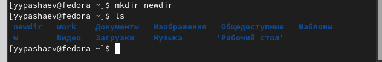{#fig:004 width=90%}

##

4.  В домашнем каталоге создаю одной командой три новых каталога с именами
letters, memos, misk

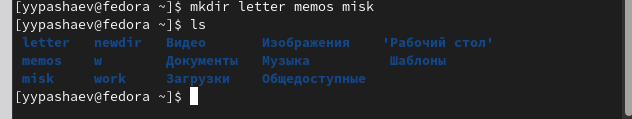{#fig:005 width=90%}

##

5. Затем удаляю эти каталоги одной командой .

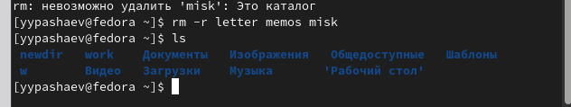{#fig:006 width=90%}

##

6. Попробую удалить ранее созданный каталог ~/newdir командой rm. Проверю,
был ли каталог удалён .

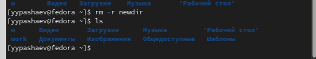{#fig:007 width=90%}

##

7.  Использую команду man для просмотра описания следующих команд: cd, pwd, mkdir,rmdir, rm

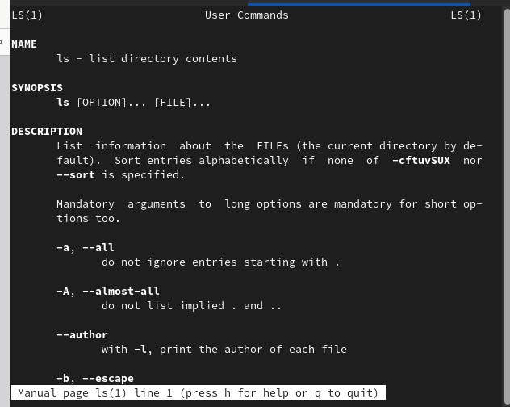{#fig:008 width=90%} .

##

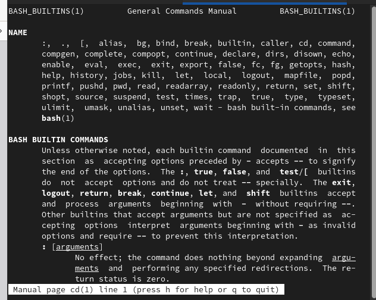{#fig:009 width=90%}

##

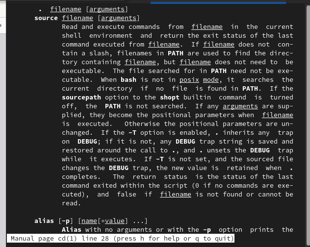{#fig:010 width=90%}

##

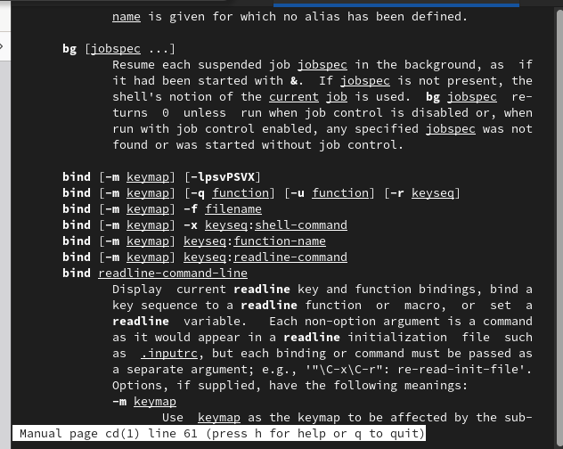{#fig:011 width=90%}

##

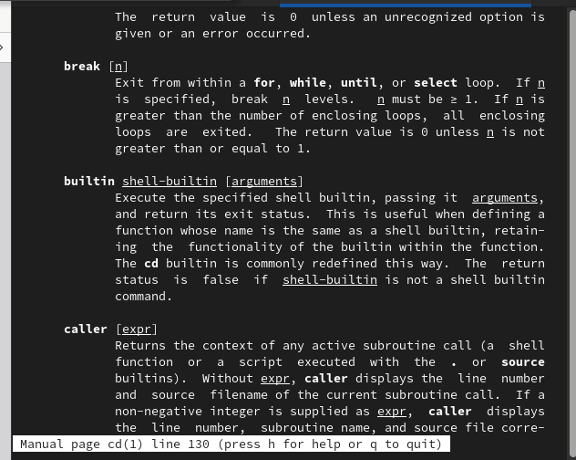{#fig:012 width=90%}

##

8.  Используя информацию, полученную при помощи команды history, выполню мо-
дификацию и исполнение нескольких команд из буфера команд.

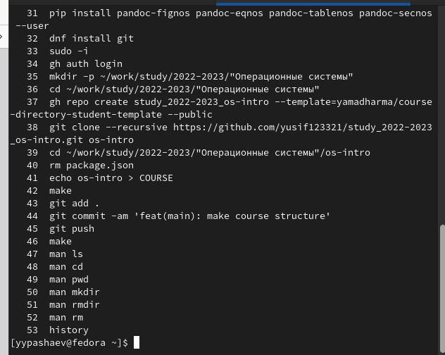{#fig:013 width=90%} .


## Результаты

-Приобрел практических навыков взаимодействия пользователя с системой по-
средством командной строки


## Итоговый слайд

- Запоминается последняя фраза. © Штирлиц

:::

