---
## Front matter
title: "Лабораторная работа №4"
subtitle: "Операционные системы"
author: "Пашаев Юсиф Юнусович"

## Generic otions
lang: ru-RU
toc-title: "Содержание"

## Bibliography
bibliography: bib/cite.bib
csl: pandoc/csl/gost-r-7-0-5-2008-numeric.csl

## Pdf output format
toc: true # Table of contents
toc-depth: 2
lof: true # List of figures
lot: true # List of tables
fontsize: 12pt
linestretch: 1.5
papersize: a4
documentclass: scrreprt
## I18n polyglossia
polyglossia-lang:
  name: russian
  options:
	- spelling=modern
	- babelshorthands=true
polyglossia-otherlangs:
  name: english
## I18n babel
babel-lang: russian
babel-otherlangs: english
## Fonts
mainfont: PT Serif
romanfont: PT Serif
sansfont: PT Sans
monofont: PT Mono
mainfontoptions: Ligatures=TeX
romanfontoptions: Ligatures=TeX
sansfontoptions: Ligatures=TeX,Scale=MatchLowercase
monofontoptions: Scale=MatchLowercase,Scale=0.9
## Biblatex
biblatex: true
biblio-style: "gost-numeric"
biblatexoptions:
  - parentracker=true
  - backend=biber
  - hyperref=auto
  - language=auto
  - autolang=other*
  - citestyle=gost-numeric
## Pandoc-crossref LaTeX customization
figureTitle: "Рис."
tableTitle: "Таблица"
listingTitle: "Листинг"
lofTitle: "Список иллюстраций"
lotTitle: "Список таблиц"
lolTitle: "Листинги"
## Misc options
indent: true
header-includes:
  - \usepackage{indentfirst}
  - \usepackage{float} # keep figures where there are in the text
  - \floatplacement{figure}{H} # keep figures where there are in the text
---

# Цель работы

Приобретение практических навыков взаимодействия пользователя с системой по-
средством командной строки

# Выполнение лабораторной работы

 1. Перехожу в каталог /tmp.
 Вывожу на экран содержимое каталога /tmp. Для этого использую команду ls(рис. @fig:001).

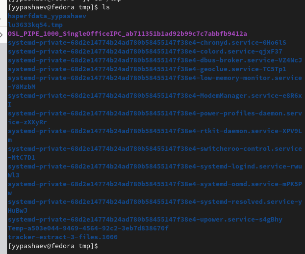{#fig:001 width=90%}

2. Определяю., есть ли в каталоге /var/spool подкаталог с именем cron

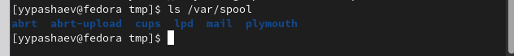{#fig:002 width=90%}

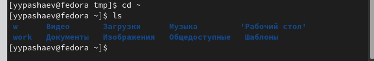{#fig:003 width=90%}

3.  Домашнем каталоге создаю новый каталог с именем newdir(рис. @fig:004).

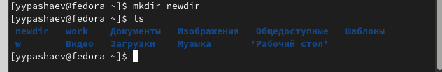{#fig:004 width=90%}

4.  В домашнем каталоге создаю одной командой три новых каталога с именами
letters, memos, misk(рис. @fig:005).

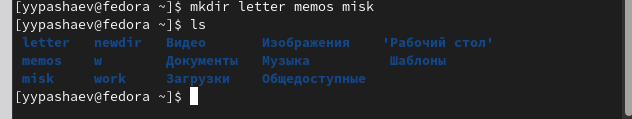{#fig:005 width=90%}

5. Затем удаляю эти каталоги одной командой (рис. @fig:006).

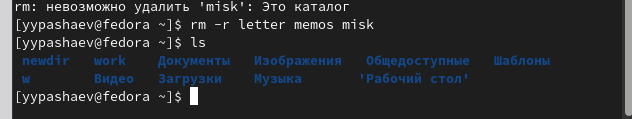{#fig:006 width=90%}

6. Попробую удалить ранее созданный каталог ~/newdir командой rm. Проверю,
был ли каталог удалён (рис. @fig:007).

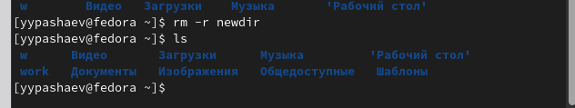{#fig:007 width=90%}

7.  Использую команду man для просмотра описания следующих команд: cd, pwd, mkdir,rmdir, rm

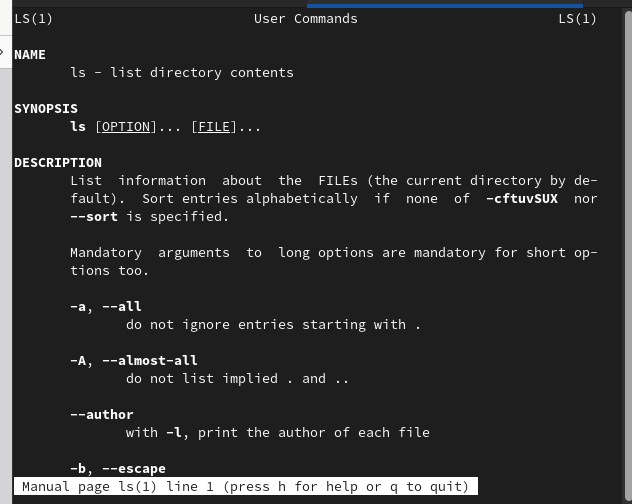{#fig:008 width=90%} .

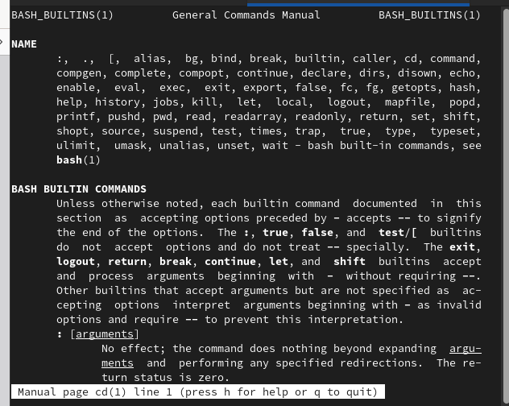{#fig:009 width=90%}

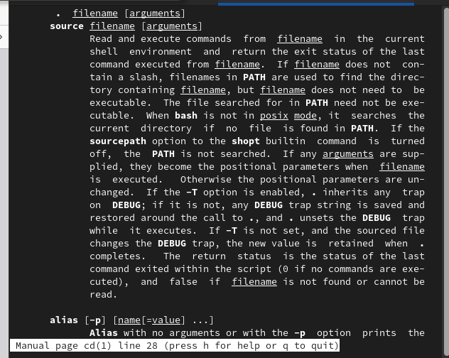{#fig:010 width=90%}

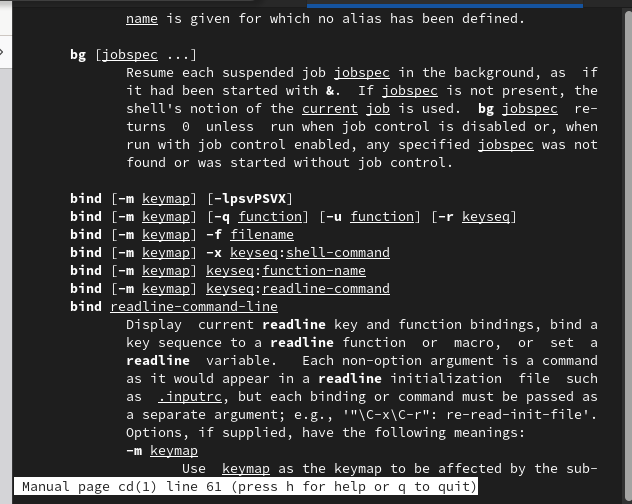{#fig:011 width=90%}

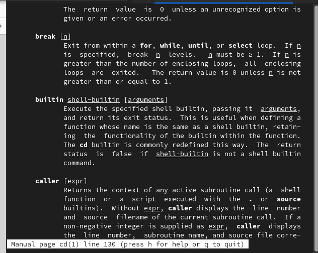{#fig:012 width=90%}

8.  Используя информацию, полученную при помощи команды history, выполню мо-
дификацию и исполнение нескольких команд из буфера команд(рис. @fig:013).

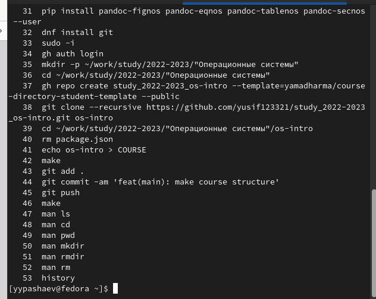{#fig:013 width=90%} .

# Выводы

Приобрел практических навыков взаимодействия пользователя с системой по-
средством командной строки

# Контрольные вопросы
1. Что такое командная строка? Ответ: текстовый интерфейс взаимодействия
пользователя с системой

2. При помощи какой команды можно определить абсолютный путь текущего
каталога? Приведите пример. Ответ: команда pwd, пример:
• cd /var/www
• pwd
• /var/www/

3. При помощи какой команды и каких опций можно определить только тип
файлов и их имена в текущем каталоге? Приведите примеры. Ответ: коман-
да ls с опцией -F.

4. Какие файлы считаются скрытыми? Как получить информацию о скрытых
файлах? Приведите примеры. Ответ: Некоторые файлы в операционной си-
стеме скрыты от просмотра и обычно используются для настройки рабочей
среды. Имена таких файлов начинаются с точки. информацию о них можно
получить с помощью команды ls с опцией -a.
5. При помощи каких команд можно удалить файл и каталог? Можно ли это
сделать одной и той же командой? Ответ: С помощью команды rm мож-
но удалить как отдельный файл так и целый каталог, в случае каталога
необходимо указать опцию -r.

6. Как определить, какие команды выполнил пользователь в сеансе работы?
Ответ: с помощью команды history.

7. Каким образом можно исправить и запустить на выполнение команду, ко-
торую пользователь уже использовал в сеансе работы? Приведите примеры
Ответ: узнать порядковый номер этой команды с помощью history затем
изменить её сл. образом: !:s//

8. Можно ли в одной строке записать несколько команд? Если да, то как?
Приведите примеры
Ответ: да, можно, необходимо разделить команды символом точки с запятой в
таком случае они будут выполняться последовательно в том порядке, в котором
они записаны пример: cd /tmp/; ls -l;pwd

9. Что такое символ экранирования? Приведите примеры использования этого
символа. Ответ: символ экранирования (обратный слэш) - символ, экрани-
рующие управляющие конструкции и символы в названии файлов и папок
Пример: ls /etc/nginx

10. Какая информация выводится на экран о файлах и каталогах, если исполь-
зуется опция l в команде ls? Ответ: тип файла, право доступа, число ссылок,
владелец, размер, дата последней ревизии, имя файла или каталога.

11. Что такое относительный путь к файлу? Приведите примеры использования
относительного и абсолютного пути при выполнении какой-либо команды.
Ответ: относительный путь - путь к тому или иному файлу или директории
относительной текущей рабочей директории, пример: папка /www/ в дирек-
тории /var/ абсолютный путь: /var/www/ относительный путь(если рабочая
директория - /var/): /www/

12. Как получить информацию об интересующей вас команде? Ответ: можно
попробовать найти информацию по использованию с помощью утилиты
man, или попробовать ввести опцию –help.

13. Какая клавиша или комбинация клавиш служит для автоматического до-
полнения вводимых команд? Ответ: клавиша Tab

# Список литературы{.unnumbered}

::: {#refs}
:::
