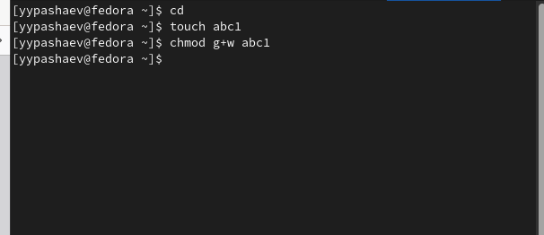

---
## Front matter
lang: ru-RU
title: "Лабораторная работа №5"
subtitle: "Операционные системы"
author:
  - Пашаев Юсиф Юнусович
institute:
  - Российский университет дружбы народов, Москва, Россия
  

## i18n babel
babel-lang: russian
babel-otherlangs: english

## Formatting pdf
toc: false
toc-title: Содержание
slide_level: 2
aspectratio: 169
section-titles: true
theme: metropolis
header-includes:
 - \metroset{progressbar=frametitle,sectionpage=progressbar,numbering=fraction}
 - '\makeatletter'
 - '\beamer@ignorenonframefalse'
 - '\makeatother'
---

# Информация

## Докладчик


  * "Пашаев Юсиф Юнусович"
  * студент НБИбд-02-22
  * Российский университет дружбы народов
 

# Вводная часть


# Создание презентации

## Процессор `pandoc`

- Pandoc: преобразователь текстовых файлов
- Сайт: <https://pandoc.org/>
- Репозиторий: <https://github.com/jgm/pandoc>

## Формат `pdf`

- Использование LaTeX
- Пакет для презентации: [beamer](https://ctan.org/pkg/beamer)
- Тема оформления: `metropolis`

## Код для формата `pdf`

```yaml
slide_level: 2
aspectratio: 169
section-titles: true
theme: metropolis
```

## Формат `html`

- Используется фреймворк [reveal.js](https://revealjs.com/)
- Используется [тема](https://revealjs.com/themes/) `beige`

## Код для формата `html`

- Тема задаётся в файле `Makefile`

```make
REVEALJS_THEME = beige 
```
# Результаты

## Получающиеся форматы

- Полученный `pdf`-файл можно демонстрировать в любой программе просмотра `pdf`
- Полученный `html`-файл содержит в себе все ресурсы: изображения, css, скрипты

# Элементы презентации


## Цели и задачи

-Ознакомление с файловой системой Linux, её структурой, именами и содержанием
каталогов. Приобретение практических навыков по применению команд для работы
с файлами и каталогами, по управлению процессами (и работами), по проверке использования диска и обслуживанию файловой системы.


## Содержание исследования

1. Выполним примеры, приведённые в первой части описания лабораторной
работы.

{#fig:001 width=90%}

##

{#fig:002 width=90%}

##

{#fig:003 width=90%}

##

{#fig:004 width=90%}

##

2.  В домашнем каталоге создаем директорию ski.plases. и перемещаем в
него файл equipment. Переименовываем файл equipment в equiplist. После этого
создаем в домашнем каталоге файл abc1 и копируем его в каталог ski.plases. и
переименовываем в equiplist2. Создаем каталог с именем equipment в
каталоге ski.plases. Перемещаем файлы equiplist и equiplist2 в каталог equipment.
Создаем и перемещаем каталог newdir в каталог ski.plases и называем его
plans.

{#fig:005 width=90%}

##

{#fig:006 width=90%}

##

3.Определю опции команды chmod, необходимые для того, чтобы присвоить перечис-
ленным ниже файлам выделенные права доступа

{#fig:007 width=90%}

##

{#fig:008 width=90%}

##

{#fig:009 width=90%}

##

{#fig:010 width=90%}

##

4. 4.2 - 4.12. Выполним все указанные действия по перемещению файлов и ката-
логов 

{#fig:011 width=90%}
 
##
 
5. Прочитаем man по командам mount, fsck, mkfs, kil 
  
{#fig:012 width=90%}


## Результаты

-В ходе данной работы мы ознакомились с файловой системой Linux, её структу-
рой, именами и содержанием каталогов. Научились совершать базовые операции
с файлами, управлять правами их доступа для пользователя и групп. Ознако-
мились с Анализом файловой системы. А также получили базовые навыки по
проверке использования диска и обслуживанию файловой системы.


## Итоговый слайд

- Запоминается последняя фраза. © Штирлиц

:::

