---
## Front matter
lang: ru-RU
title: "Лабораторная работа №6"
subtitle: "Операционные системы"
author:
  - Пашаев Юсиф Юнусович
institute:
  - Российский университет дружбы народов, Москва, Россия
  

## i18n babel
babel-lang: russian
babel-otherlangs: english

## Formatting pdf
toc: false
toc-title: Содержание
slide_level: 2
aspectratio: 169
section-titles: true
theme: metropolis
header-includes:
 - \metroset{progressbar=frametitle,sectionpage=progressbar,numbering=fraction}
 - '\makeatletter'
 - '\beamer@ignorenonframefalse'
 - '\makeatother'
---

# Информация

## Докладчик


  * "Пашаев Юсиф Юнусович"
  * студент НБИбд-02-22
  * Российский университет дружбы народов
 


# Создание презентации

## Процессор `pandoc`

- Pandoc: преобразователь текстовых файлов
- Сайт: <https://pandoc.org/>
- Репозиторий: <https://github.com/jgm/pandoc>

## Формат `pdf`

- Использование LaTeX
- Пакет для презентации: [beamer](https://ctan.org/pkg/beamer)
- Тема оформления: `metropolis`

## Код для формата `pdf`

```yaml
slide_level: 2
aspectratio: 169
section-titles: true
theme: metropolis
```

## Формат `html`

- Используется фреймворк [reveal.js](https://revealjs.com/)
- Используется [тема](https://revealjs.com/themes/) `beige`

## Код для формата `html`

- Тема задаётся в файле `Makefile`

```make
REVEALJS_THEME = beige 
```
# Результаты


# Элементы презентации


## Цели и задачи

-Ознакомление с инструментами поиска файлов и фильтрации текстовых данных.
Приобретение практических навыков: по управлению процессами (и заданиями), по
проверке использования диска и обслуживанию файловых систем

## Содержание исследования

1. Запишу в файл file.txt названия файлов, содержащихся в каталоге /etc. Допи-
шиу в этот же файл названия файлов, содержащихся в  домашнем каталоге

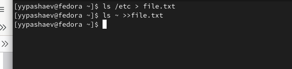{#fig:001 width=90%}

##

2. Выведу имена всех файлов из file.txt, имеющих расширение .conf, после чего
запишу их в новый текстовой файл conf.txt. 

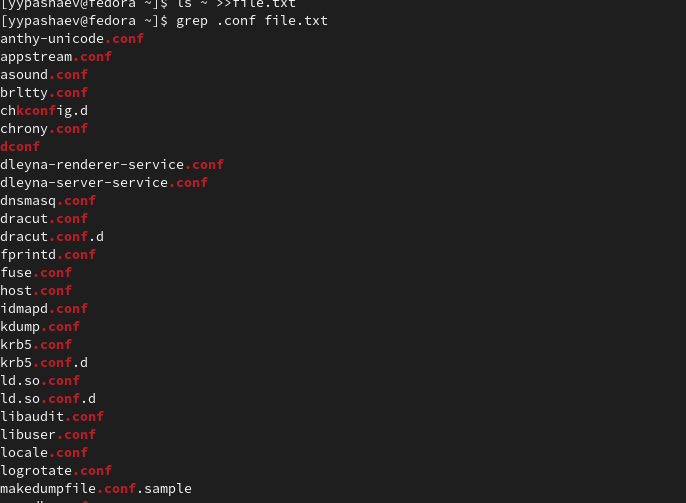{#fig:002 width=90%}

##

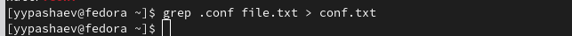{#fig:003 width=90%}

##

3.  Определю, какие файлы в  домашнем каталоге имеют имена, начинавшиеся
с символа c? 

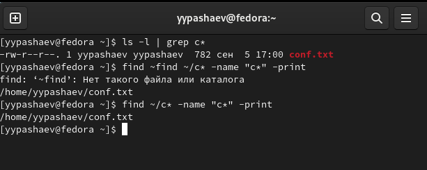{#fig:004 width=90%}

##

4. Запускаю  в фоновом режиме процесс, который будет записывать в файл ~/logfile
файлы, имена которых начинаются с log. Удалю файл ~/logfile.

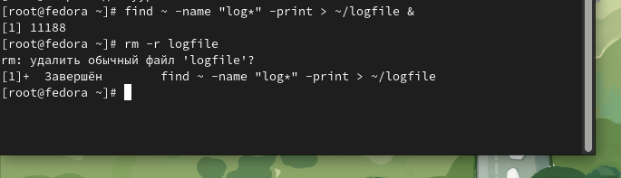{#fig:005 width=90%}

##

5. Запускаю из консоли в фоновом режиме редактор gedit. Определяю идентификатор процесса gedit, используя команду ps, конвейер и фильтр grep

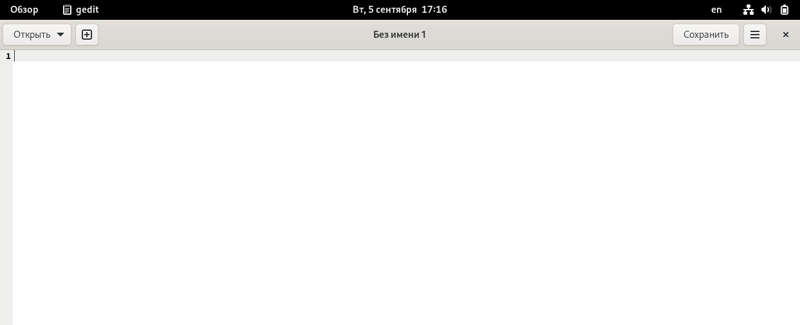{#fig:006 width=90%}

##

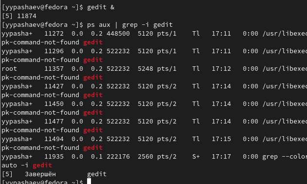{#fig:007 width=90%}

##

6. Прочту справку (man) команды kill 

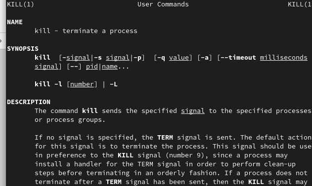{#fig:008 width=90%}

##

7. Выполню команды df и du 

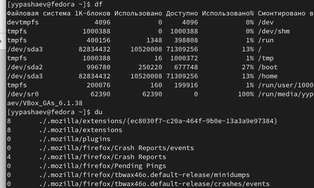{#fig:009 width=90%}

##

8. Воспользовавшись справкой команды find, выведу имена всех директорий, имею-
щихся в  домашнем каталоге.

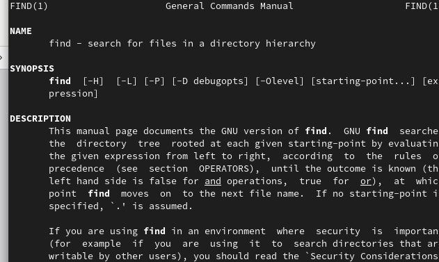{#fig:010 width=90%}

##

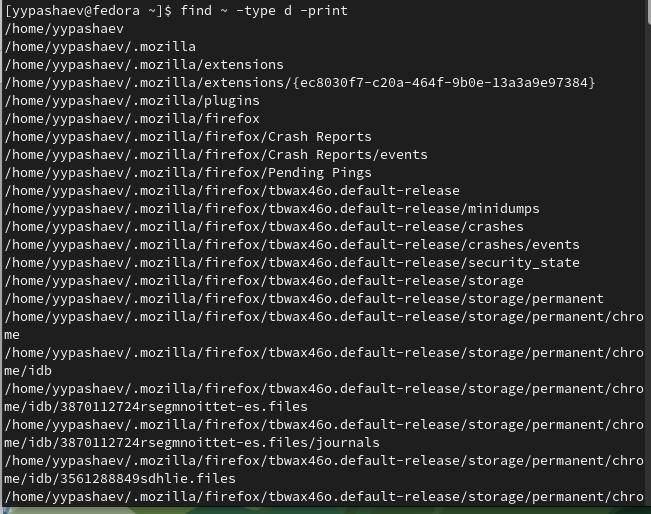{#fig:011 width=90%} 


## Результаты

-В данной работе мы ознакомились с инструментами поиска файлов и фильтрации
текстовых данных. А также приобрели практические навыки по управлению
процессами


## Итоговый слайд

- Запоминается последняя фраза. © Штирлиц

:::

