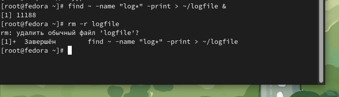
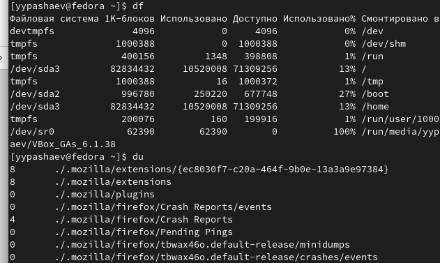
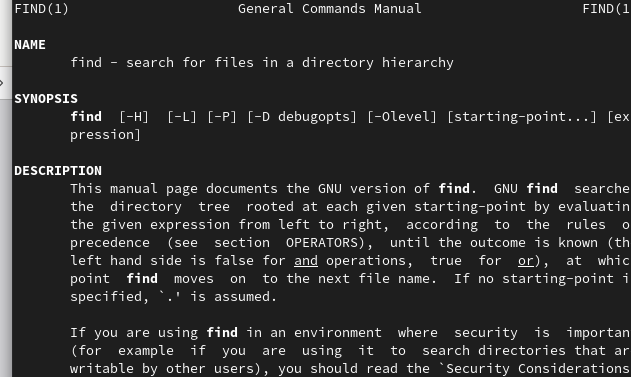
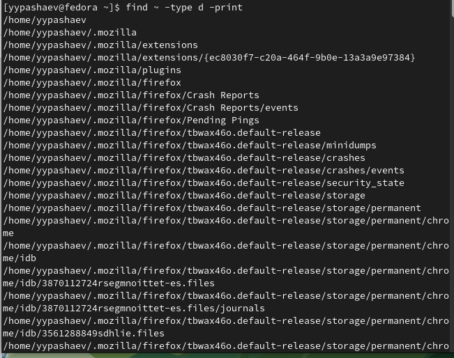

---
## Front matter
title: "Лабораторная работа №6"
subtitle: "Операционные системы"
author: "Пашаев Юсиф Юнусович"

## Generic otions
lang: ru-RU
toc-title: "Содержание"

## Bibliography
bibliography: bib/cite.bib
csl: pandoc/csl/gost-r-7-0-5-2008-numeric.csl

## Pdf output format
toc: true # Table of contents
toc-depth: 2
lof: true # List of figures
lot: true # List of tables
fontsize: 12pt
linestretch: 1.5
papersize: a4
documentclass: scrreprt
## I18n polyglossia
polyglossia-lang:
  name: russian
  options:
	- spelling=modern
	- babelshorthands=true
polyglossia-otherlangs:
  name: english
## I18n babel
babel-lang: russian
babel-otherlangs: english
## Fonts
mainfont: PT Serif
romanfont: PT Serif
sansfont: PT Sans
monofont: PT Mono
mainfontoptions: Ligatures=TeX
romanfontoptions: Ligatures=TeX
sansfontoptions: Ligatures=TeX,Scale=MatchLowercase
monofontoptions: Scale=MatchLowercase,Scale=0.9
## Biblatex
biblatex: true
biblio-style: "gost-numeric"
biblatexoptions:
  - parentracker=true
  - backend=biber
  - hyperref=auto
  - language=auto
  - autolang=other*
  - citestyle=gost-numeric
## Pandoc-crossref LaTeX customization
figureTitle: "Рис."
tableTitle: "Таблица"
listingTitle: "Листинг"
lofTitle: "Список иллюстраций"
lotTitle: "Список таблиц"
lolTitle: "Листинги"
## Misc options
indent: true
header-includes:
  - \usepackage{indentfirst}
  - \usepackage{float} # keep figures where there are in the text
  - \floatplacement{figure}{H} # keep figures where there are in the text
---

# Цель работы

Ознакомление с инструментами поиска файлов и фильтрации текстовых данных.
Приобретение практических навыков: по управлению процессами (и заданиями), по
проверке использования диска и обслуживанию файловых систем

# Выполнение лабораторной работы

1. Запишу в файл file.txt названия файлов, содержащихся в каталоге /etc. Допи-
шиу в этот же файл названия файлов, содержащихся в  домашнем каталоге(рис. @fig:001).

{#fig:001 width=90%}

2. Выведу имена всех файлов из file.txt, имеющих расширение .conf, после чего
запишу их в новый текстовой файл conf.txt. 

{#fig:002 width=90%}

{#fig:003 width=90%}

3.  Определю, какие файлы в  домашнем каталоге имеют имена, начинавшиеся
с символа c? (рис. @fig:004)

{#fig:004 width=90%}

4. Запускаю  в фоновом режиме процесс, который будет записывать в файл ~/logfile
файлы, имена которых начинаются с log. Удалю файл ~/logfile.(рис. @fig:005)

{#fig:005 width=90%}

5. Запускаю из консоли в фоновом режиме редактор gedit. Определяю идентификатор процесса gedit, используя команду ps, конвейер и фильтр grep

{#fig:006 width=90%}

{#fig:007 width=90%}

6. Прочту справку (man) команды kill (рис. @fig:008)

{#fig:008 width=90%}

7. Выполню команды df и du (рис. @fig:009)

{#fig:009 width=90%}

8. Воспользовавшись справкой команды find, выведу имена всех директорий, имею-
щихся в  домашнем каталоге.

{#fig:010 width=90%}

{#fig:011 width=90%} 

# Выводы

В данной работе мы ознакомились с инструментами поиска файлов и фильтрации
текстовых данных. А также приобрели практические навыки по управлению
процессами

# Контрольные вопросы
1. Какие потоки ввода вывода вы знаете? Ответ:
a) stdin — стандартный поток ввода (клавиатура),
b) stdout — стандартный поток вывода (консоль),
c) stderr — стандартный поток вывод сообщений об ошибках на экран
2. Объясните разницу между операцией > и » Ответ: Разница заключается в
том, что Символ > используется для переназначения стандартного ввода
команды, а символ » используется для присоединения данных в конец файла
стандартного вывода команды.
3. Что такое конвейер? Ответ: Конвейер – это способ связи между двумя про-
граммами. Например: конвейер pipe служит для объединения простых ко-
манд или утилит в цепочки, в которых результат работы предыдущей коман-
ды передается последующей. Синтаксис у конвейера следующий: команда1
| команда 2
4. Что такое процесс? Чем это понятие отличается от программы? Ответ:
Процесс - это программа, которая выполняется в отдельном виртуальном
адресном пространстве независимо от других программ или их пользова-
нию по необходимости.
5. Что такое PID и GID? Ответ: Во первых id — UNIX-утилита, выводящая инфор-
мацию об указанном пользователе USERNAME или текущем пользователе,
который запустил данную команду и не указал явно имя пользователя.
1) GID – (Group ID) - идентификатор группы
2) UID – (User ID) - идентификатор группы Обычно UID является — положи-
тельным целым число м в диапазоне от 0 до 65535, по которому в системе
однозначно отслеживаются действия пользователя
6. Что такое задачи и какая команда позволяет ими управлять? Ответ: Запу-
щенные фоном программы называются задачами(процессами) (jobs). Ими
можно управлять с помощью команды jobs, которая выводит список запу-
щенных в данный момент процессов. Для завершения процесса необходимо
выполнить команду : kill % номер задачи
7. Найдите информацию об утилитах top и htop. Каковы их функции? От-
вет: Top это консольная команда, которая выводит список работающих в
системе процессов и информации о них. По умолчанию она в реальном
времени сортирует их по нагрузке на процессор.Htop же является альтерна-
тивой программы top она предназначенная для вывода на терминал списка
запущенных процессов и информации о них.
8. Назовите и дайте характеристику команде поиска файлов. Приведите при-
меры использования этой команды. Ответ: Команда find используется для
поиска и отображения имен файлов, соответствующих заданной строке
символов. Синтаксис: find trek [-options] Пример: Задача - Вывести на экран
имена файлов из каталога /etc и его подкаталогов, Заканчивающихся на k:
find ~ -name “*k” -print
9. Можно ли по контексту (содержанию) найти файл? Если да, то как? Ответ:
Можно, команда grep способна обрабатывать вывод других файлов. Для
этого надо использовать конвейер, связав вывод команды с вводом grep.
Пример: Задача - показать строки в каталоге /dreams с именами начинаю-
щимися на t, в которых есть фраза: I like of Operating systems grep I like of
Operating systems t*
10. Как определить объем свободной памяти на жёстком диске? Ответ: Команда
df показывает размер каждого смонтированного раздела диска. Например
команда: df -h
11. Как определить объем вашего домашнего каталога? Ответ: Команда du
показывает число килобайт, используемое каждым файлом или каталогом.
Например команда: du -sh
12. Как удалить зависший процесс? Ответ: Перед тем, как выполнить останов-
ку процесса, нужно определить его PID. Когда известен PID , мы можем
убить его командой kill. Команда kill принимает в качестве параметра PID
процесса. PID можно узнать с помощью команд ps, grep, top или htop
# Список литературы{.unnumbered}

::: {#refs}
:::
