---
## Front matter
lang: ru-RU
title: "Лабораторная работа №7"
subtitle: "Операционные системы"
author:
  - Пашаев Юсиф Юнусович
institute:
  - Российский университет дружбы народов, Москва, Россия
  

## i18n babel
babel-lang: russian
babel-otherlangs: english

## Formatting pdf
toc: false
toc-title: Содержание
slide_level: 2
aspectratio: 169
section-titles: true
theme: metropolis
header-includes:
 - \metroset{progressbar=frametitle,sectionpage=progressbar,numbering=fraction}
 - '\makeatletter'
 - '\beamer@ignorenonframefalse'
 - '\makeatother'
---

# Информация

## Докладчик


  * "Пашаев Юсиф Юнусович"
  * студент НБИбд-02-22
  * Российский университет дружбы народов
 


# Создание презентации

## Процессор `pandoc`

- Pandoc: преобразователь текстовых файлов
- Сайт: <https://pandoc.org/>
- Репозиторий: <https://github.com/jgm/pandoc>

## Формат `pdf`

- Использование LaTeX
- Пакет для презентации: [beamer](https://ctan.org/pkg/beamer)
- Тема оформления: `metropolis`

## Код для формата `pdf`

```yaml
slide_level: 2
aspectratio: 169
section-titles: true
theme: metropolis
```

## Формат `html`

- Используется фреймворк [reveal.js](https://revealjs.com/)
- Используется [тема](https://revealjs.com/themes/) `beige`

## Код для формата `html`

- Тема задаётся в файле `Makefile`

```make
REVEALJS_THEME = beige 
```
# Результаты


# Элементы презентации


## Цели и задачи

-Освоение основных возможностей командной оболочки Midnight Commander. Приоб-
ретение навыков практической работы по просмотру каталогов и файлов; манипуляций
с ними

## Содержание исследования

1. Изучаю информацию о mc, вызвав в командной строке man mc .

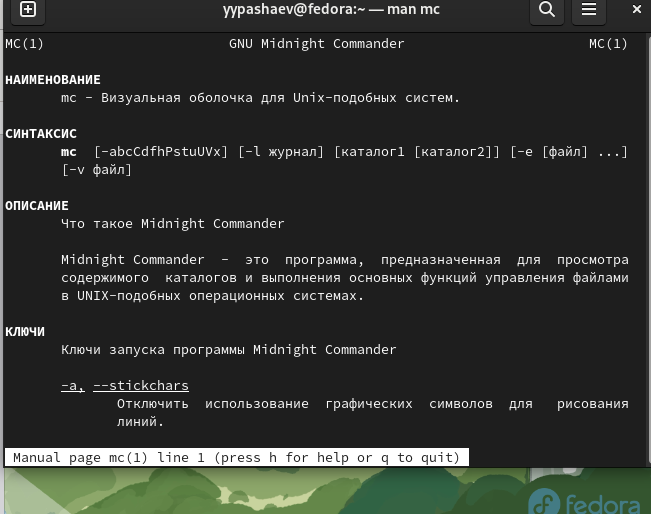{#fig:001 width=90%}

##

2. Запускаю из командной строки mc, изучаю его структуру и меню. (

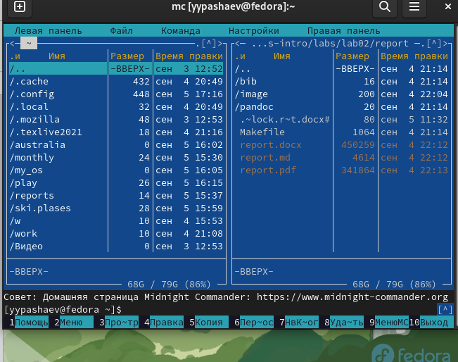{#fig:002 width=90%}

##

3. Выполняю несколько операций в mc, используя управляющие клавиши (операции
с панелями; выделение/отмена выделения файлов, копирование/перемещение фай-
лов, получение информации о размере и правах доступа на файлы и/или каталоги
и т.п.) 

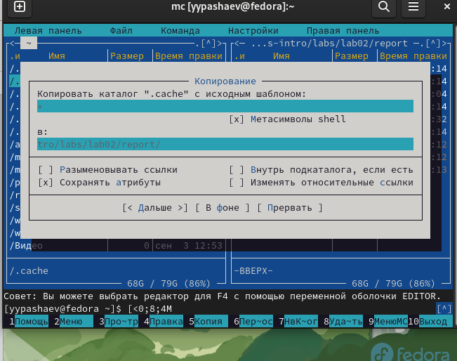{#fig:003 width=90%}

##

4. Используя возможности подменю Файл , выполняю:
– просмотр содержимого текстового файла;
– редактирование содержимого текстового файла (без сохранения результатов
редактирования);
– создание каталога;
– копирование в файлов в созданный каталог.

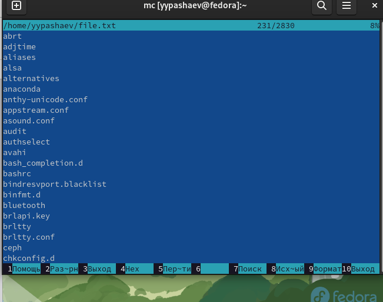{#fig:004 width=90%}

##

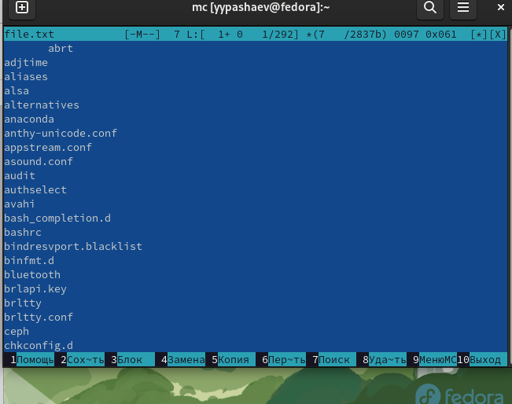{#fig:005 width=90%}

##

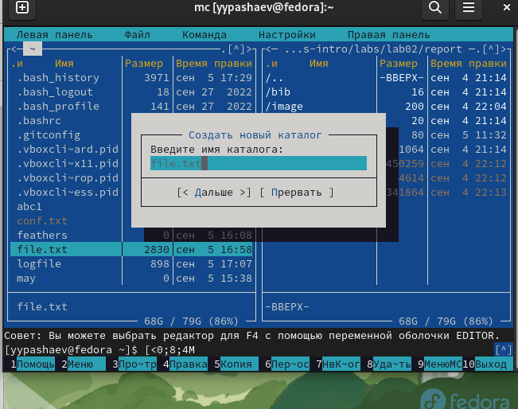{#fig:006 width=90%}

##

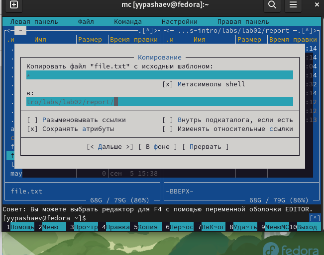{#fig:007 width=90%}

##

5.  С помощью соответствующих средств подменю Команда осуществлю:
– поиск в файловой системе файла с заданными условиями (например, файла
с расширением .c или .cpp, содержащего строку main) 

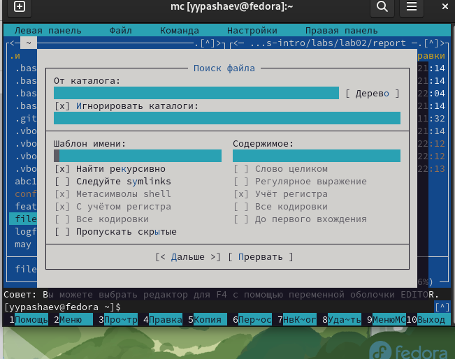{#fig:008 width=90%}

##

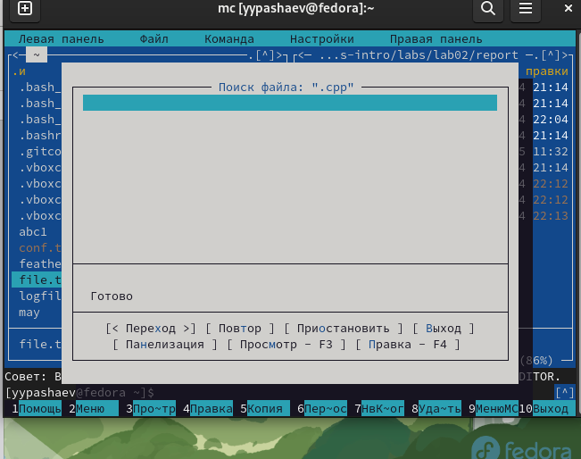{#fig:009 width=90%}

##

6. Создаю текстовой файл text.txt. Вставлю в открытый файл небольшой фрагмент текста, скопированный из любого другого файла или Интернет

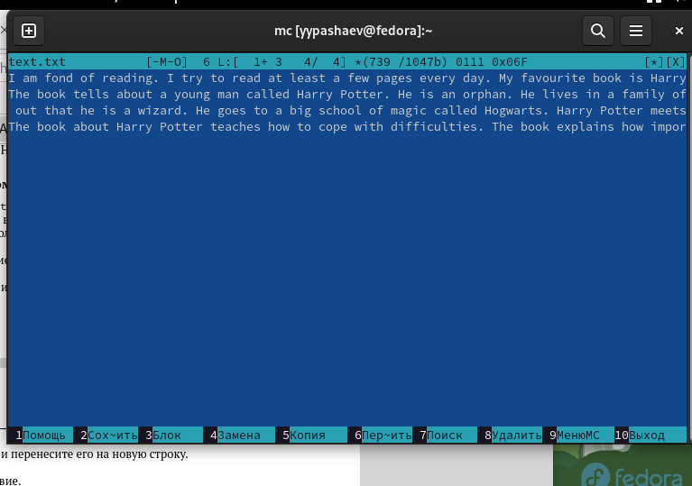{#fig:010 width=90%}

##

7.Проделайте с текстом следующие манипуляции, используя горячие клавиши:
 Удалю строку текста,выделю фрагмент текста и скопируйте его на новую строку,выделю фрагмент текста и перенесу его на новую строку, Сохраню файл.Отменю последнее действие.
 
 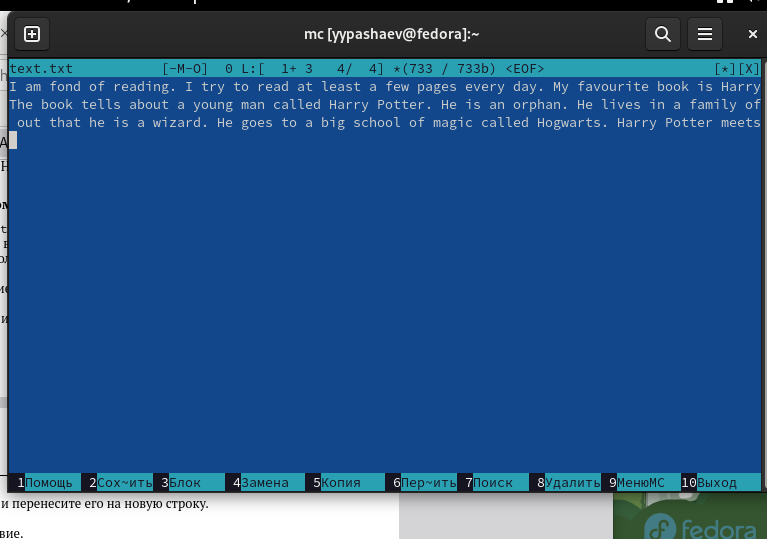{#fig:011 width=90%}
 
##
 
 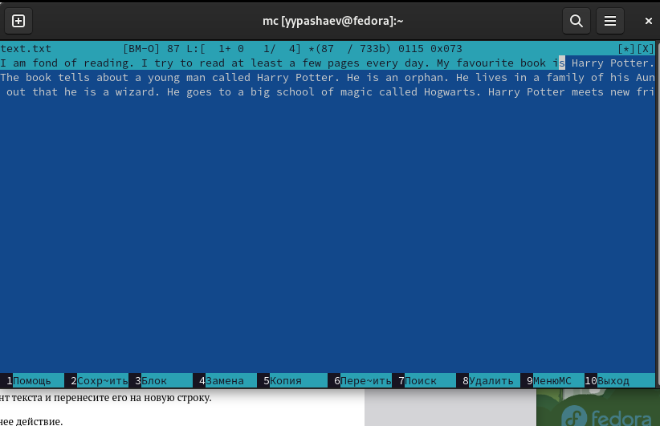{#fig:012 width=90%}
 
##

 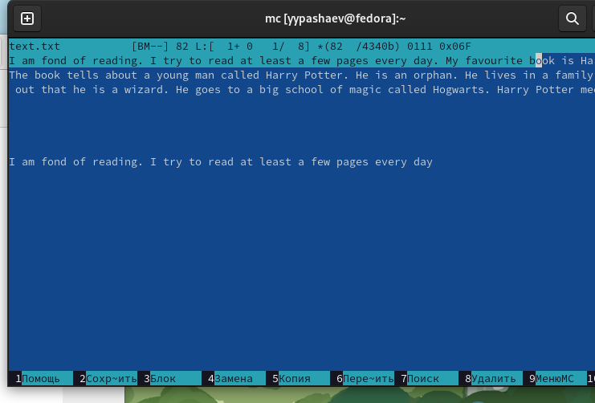{#fig:013 width=90%}
 
##
 
 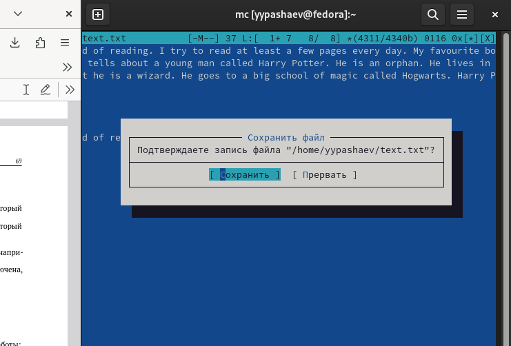{#fig:014 width=90%}


## Результаты

-Освоил основные возможности командной оболочки Midnight Commander. Приоб-
рел навыки  практической работы по просмотру каталогов и файлов; манипуляций
с ними


## Итоговый слайд

- Запоминается последняя фраза. © Штирлиц

:::

