---
## Front matter
title: "Лабораторная работа №7"
subtitle: "Операцие системы"
author: "Пашаев Юсиф Юнусович"

## Generic otions
lang: ru-RU
toc-title: "Содержание"

## Bibliography
bibliography: bib/cite.bib
csl: pandoc/csl/gost-r-7-0-5-2008-numeric.csl

## Pdf output format
toc: true # Table of contents
toc-depth: 2
lof: true # List of figures
lot: true # List of tables
fontsize: 12pt
linestretch: 1.5
papersize: a4
documentclass: scrreprt
## I18n polyglossia
polyglossia-lang:
  name: russian
  options:
	- spelling=modern
	- babelshorthands=true
polyglossia-otherlangs:
  name: english
## I18n babel
babel-lang: russian
babel-otherlangs: english
## Fonts
mainfont: PT Serif
romanfont: PT Serif
sansfont: PT Sans
monofont: PT Mono
mainfontoptions: Ligatures=TeX
romanfontoptions: Ligatures=TeX
sansfontoptions: Ligatures=TeX,Scale=MatchLowercase
monofontoptions: Scale=MatchLowercase,Scale=0.9
## Biblatex
biblatex: true
biblio-style: "gost-numeric"
biblatexoptions:
  - parentracker=true
  - backend=biber
  - hyperref=auto
  - language=auto
  - autolang=other*
  - citestyle=gost-numeric
## Pandoc-crossref LaTeX customization
figureTitle: "Рис."
tableTitle: "Таблица"
listingTitle: "Листинг"
lofTitle: "Список иллюстраций"
lotTitle: "Список таблиц"
lolTitle: "Листинги"
## Misc options
indent: true
header-includes:
  - \usepackage{indentfirst}
  - \usepackage{float} # keep figures where there are in the text
  - \floatplacement{figure}{H} # keep figures where there are in the text
---

# Цель работы

Освоение основных возможностей командной оболочки Midnight Commander. Приоб-
ретение навыков практической работы по просмотру каталогов и файлов; манипуляций
с ними

# Выполнение лабораторной работы

1. Изучаю информацию о mc, вызвав в командной строке man mc (рис. @fig:001).

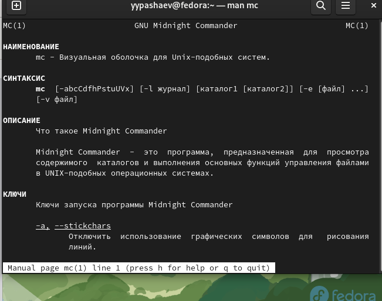{#fig:001 width=90%}

2. Запускаю из командной строки mc, изучаю его структуру и меню. (рис. @fig:002).

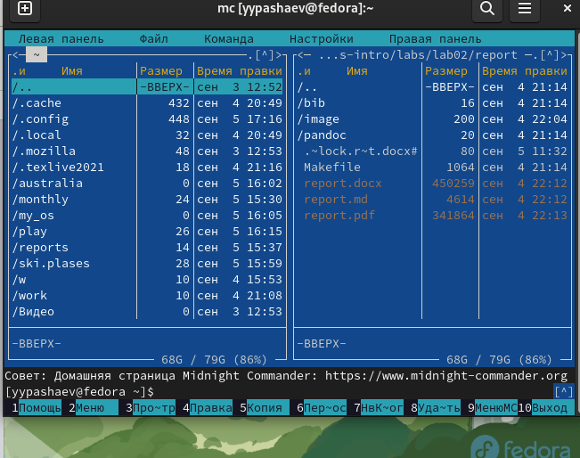{#fig:002 width=90%}

3. Выполняю несколько операций в mc, используя управляющие клавиши (операции
с панелями; выделение/отмена выделения файлов, копирование/перемещение фай-
лов, получение информации о размере и правах доступа на файлы и/или каталоги
и т.п.)  (рис. @fig:003)

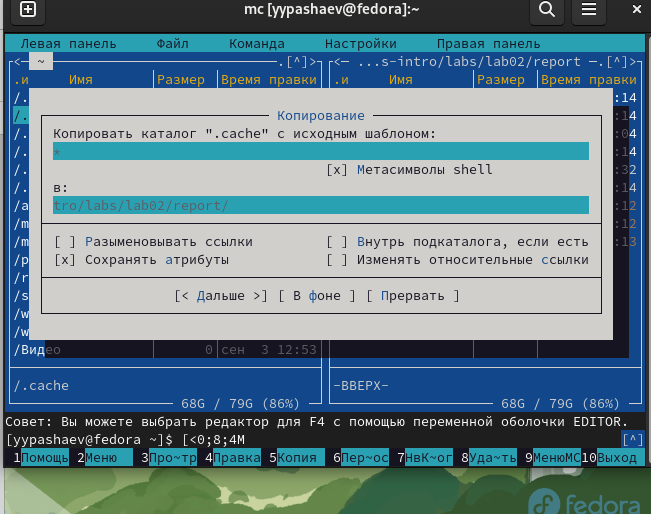{#fig:003 width=90%}

4. Используя возможности подменю Файл , выполняю:
– просмотр содержимого текстового файла;
– редактирование содержимого текстового файла (без сохранения результатов
редактирования);
– создание каталога;
– копирование в файлов в созданный каталог.

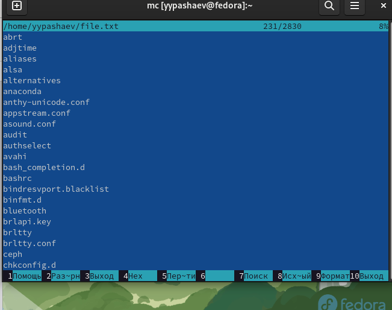{#fig:004 width=90%}

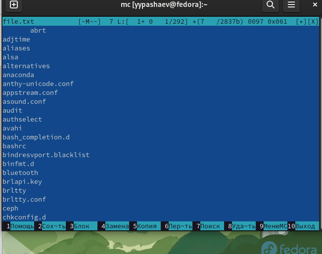{#fig:005 width=90%}

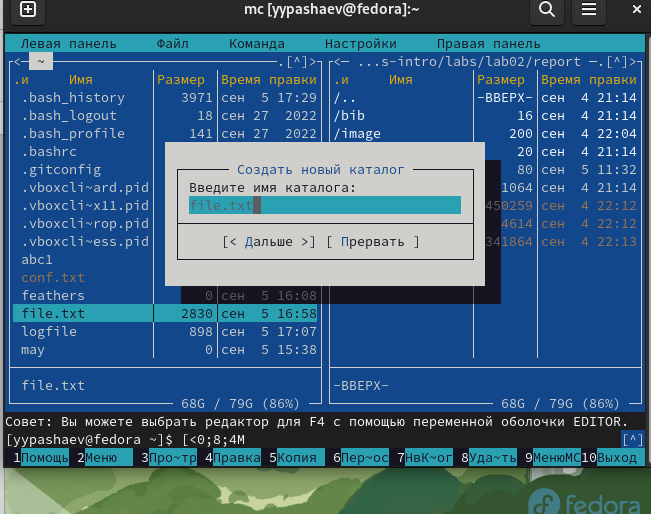{#fig:006 width=90%}

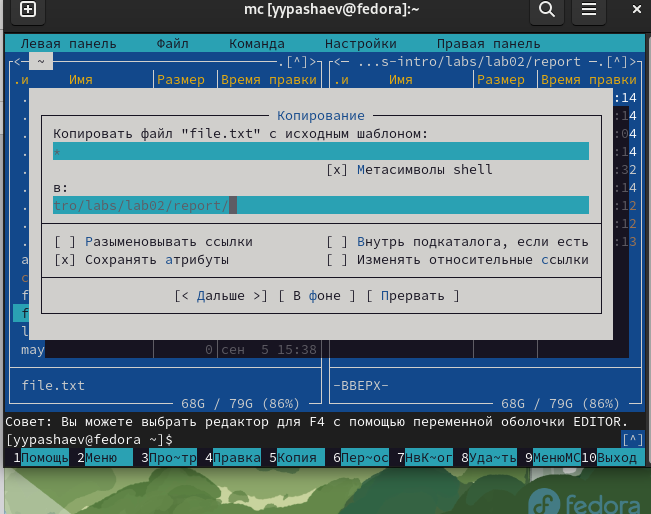{#fig:007 width=90%}

5.  С помощью соответствующих средств подменю Команда осуществлю:
– поиск в файловой системе файла с заданными условиями (например, файла
с расширением .c или .cpp, содержащего строку main) 

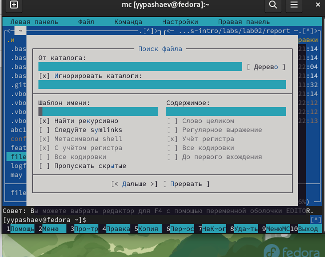{#fig:008 width=90%}

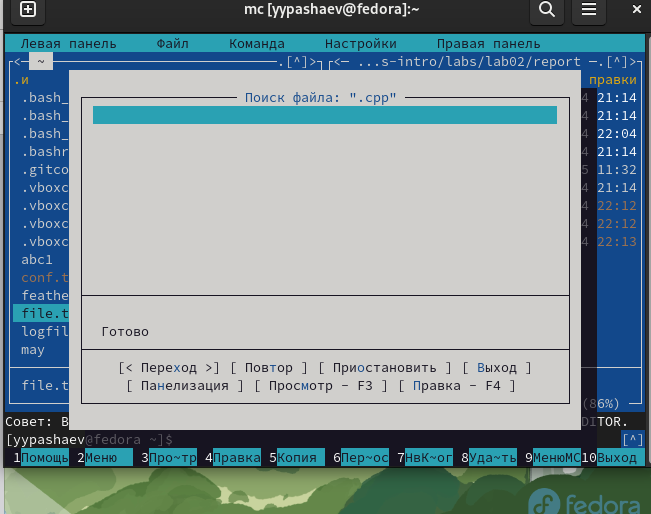{#fig:009 width=90%}

6. Создаю текстовой файл text.txt. Вставлю в открытый файл небольшой фрагмент текста, скопированный из любого другого файла или Интернет(рис. @fig:010)

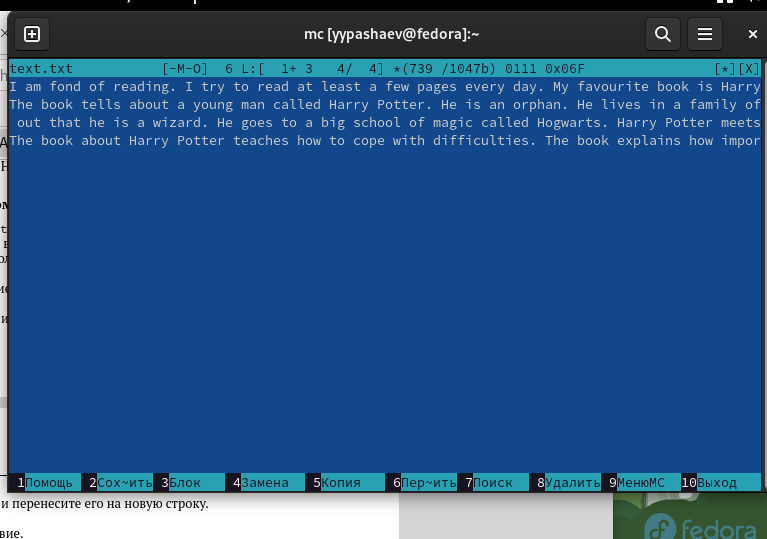{#fig:010 width=90%}

7.Проделайте с текстом следующие манипуляции, используя горячие клавиши:
 Удалю строку текста,выделю фрагмент текста и скопируйте его на новую строку,выделю фрагмент текста и перенесу его на новую строку, Сохраню файл.Отменю последнее действие.
 
 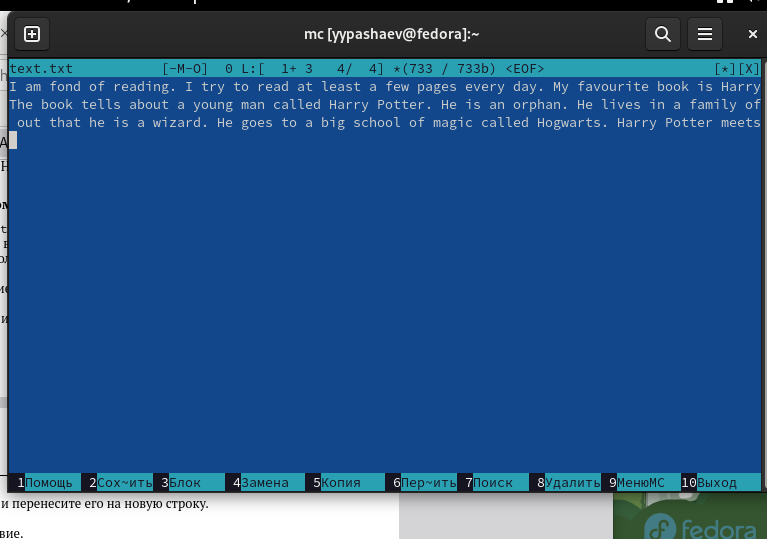{#fig:011 width=90%}
 
 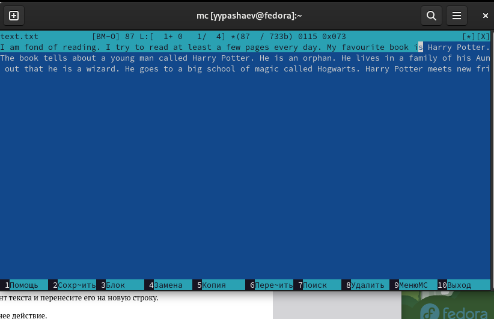{#fig:012 width=90%}
 
 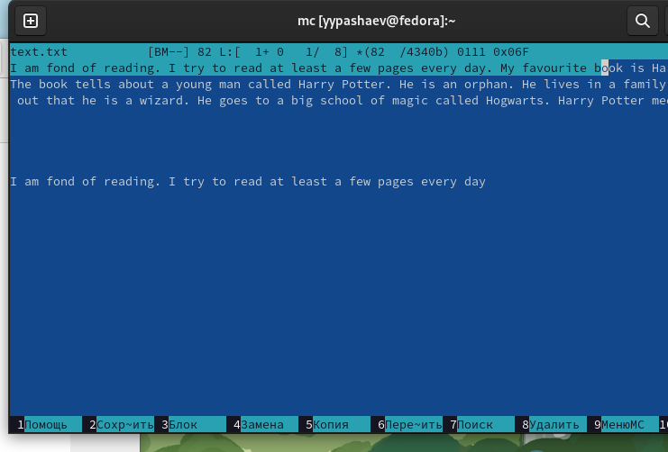{#fig:013 width=90%}
 
 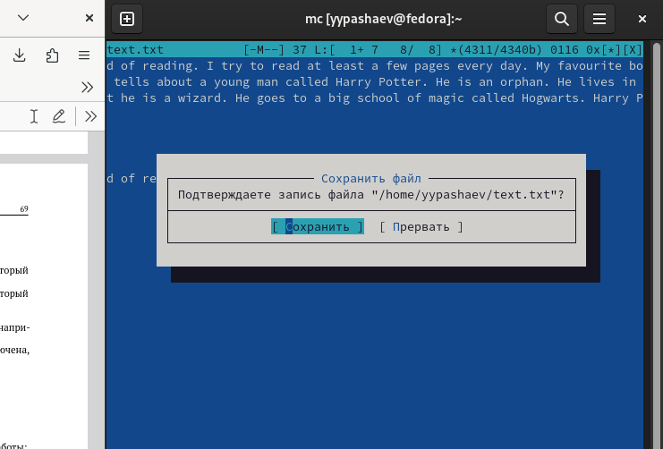{#fig:014 width=90%}
 
# Выводы

Освоил основные возможности командной оболочки Midnight Commander. Приоб-
рел навыки  практической работы по просмотру каталогов и файлов; манипуляций
с ними

# Список литературы{.unnumbered}

::: {#refs}
:::
