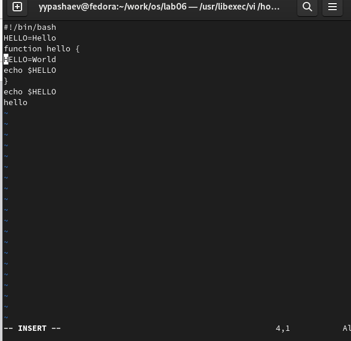

---
## Front matter
lang: ru-RU
title: Лабораторная работа №8
subtitle: Операционные системы
author:
  - Пашаев Юсиф Юнусович
institute:
  - Российский университет дружбы народов, Москва, Россия
 

## i18n babel
babel-lang: russian
babel-otherlangs: english

## Formatting pdf
toc: false
toc-title: Содержание
slide_level: 2
aspectratio: 169
section-titles: true
theme: metropolis
header-includes:
 - \metroset{progressbar=frametitle,sectionpage=progressbar,numbering=fraction}
 - '\makeatletter'
 - '\beamer@ignorenonframefalse'
 - '\makeatother'
---

# Информация

## Докладчик

:::::::::::::: {.columns align=center}
::: {.column width="70%"}

  * Юсиф Пашаев Юнусович
  * студент НБИбд-02-22
  * Российский университет дружбы народов
 

:::
::::::::::::::

# Вводная часть

## Материалы и методы

- Процессор `pandoc` для входного формата Markdown
- Результирующие форматы
	- `pdf`
	- `html`
- Автоматизация процесса создания: `Makefile`

# Создание презентации

## Процессор `pandoc`

- Pandoc: преобразователь текстовых файлов
- Сайт: <https://pandoc.org/>
- Репозиторий: <https://github.com/jgm/pandoc>

## Формат `pdf`

- Использование LaTeX
- Пакет для презентации: [beamer](https://ctan.org/pkg/beamer)
- Тема оформления: `metropolis`

## Код для формата `pdf`

```yaml
slide_level: 2
aspectratio: 169
section-titles: true
theme: metropolis
```

## Формат `html`

- Используется фреймворк [reveal.js](https://revealjs.com/)
- Используется [тема](https://revealjs.com/themes/) `beige`

## Код для формата `html`

- Тема задаётся в файле `Makefile`

```make
REVEALJS_THEME = beige 
```
# Результаты


# Элементы презентации

## Цели и задачи

- Познакомиться с операционной системой Linux. Получить практические навыки работы с редактором vi, установленным по умолчанию практически во всех дистрибутивах.

## Содержание исследования

1. Создаю каталог с именем ~/work/os/lab06. Перехожу во вновь созданный каталог .

{#fig:001 width=90%}

##

2. Вызовите vi и создайте файл hello.sh .

{#fig:002 width=90%}

##

3. Нажал клавишу i и ввел следующий текст 

{#fig:003 width=90%}

##

4.Сделаю файл исполняемым 

{#fig:004 width=90%}

##

5. Вызову vi на редактирование файла 

{#fig:005 width=90%}

##

6. Установлю курсор в конец слова HELL второй строки ,перейду в режим вставки и заменю на HELLO. нажму Esc для возврата в командный режим

{#fig:006 width=90%} 

##

7. Установлю курсор на четвертую строку и сотру слово LOCAL 

{#fig:007 width=90%} 

##

8. Установлю курсор на последней строке файла. Вставлю после неё строку,содержащую следующий текст: echo $HELLO 

{#fig:008 width=90%} 

##

9. Удалите последнюю строку.ВведУ команду отмены изменений u для отмены последней команды.

{#fig:009 width=90%} 

##

10. Введу символ : для перехода в режим последней строки. Запишу произведённые
изменения и выйдите из vi 

{#fig:010 width=90%}

##

## Результаты

Познакомился с операционной системой Linux. Получил практические навыки рабо-
ты с редактором vi, установленным по умолчанию практически во всех дистрибутивах


## Итоговый слайд

- Запоминается последняя фраза. © Штирлиц

:::

