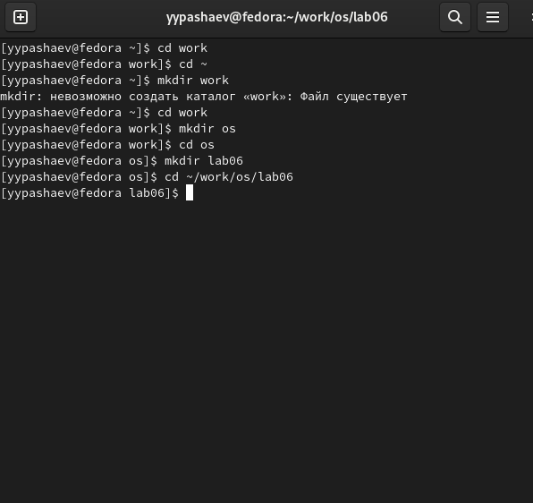
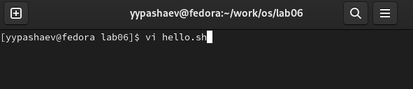
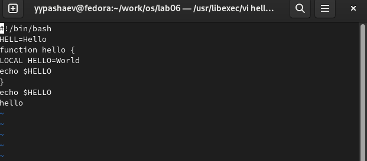
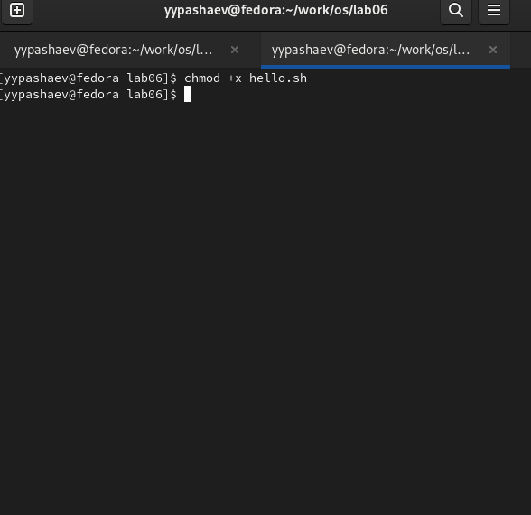
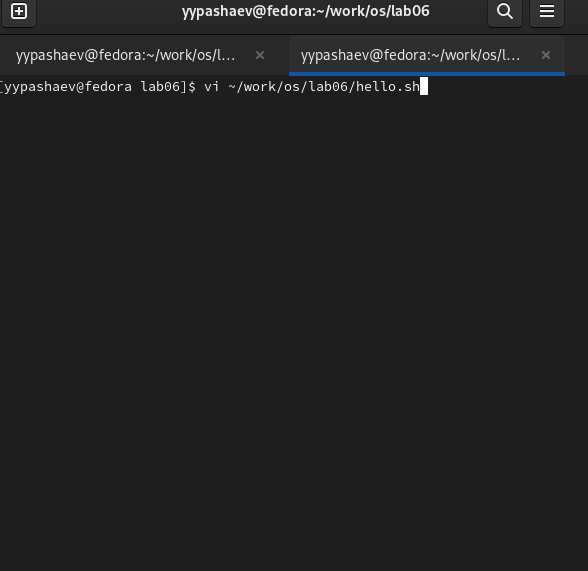
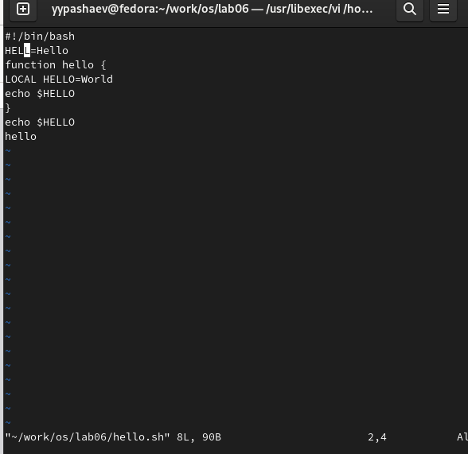
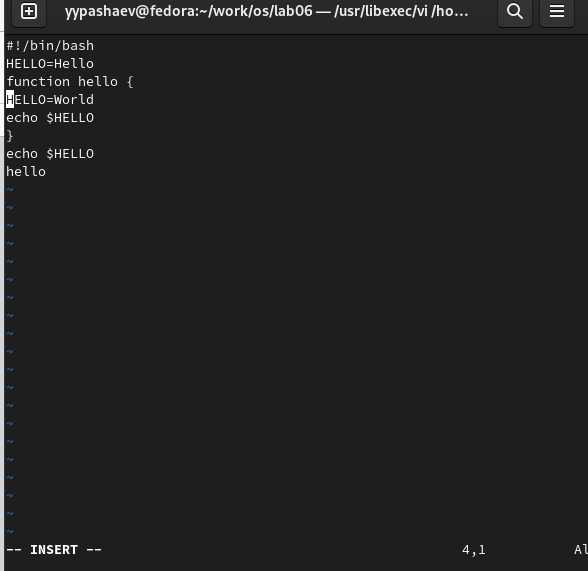
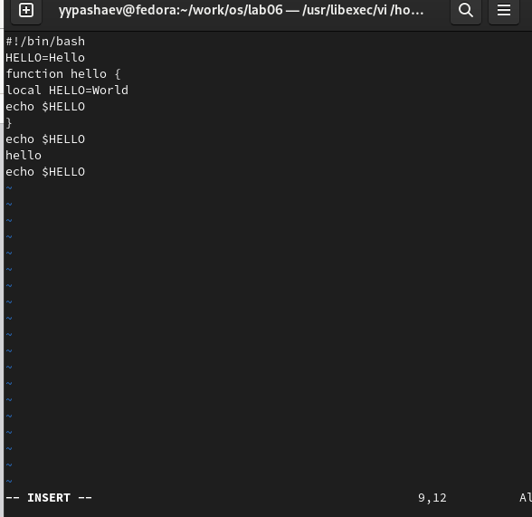
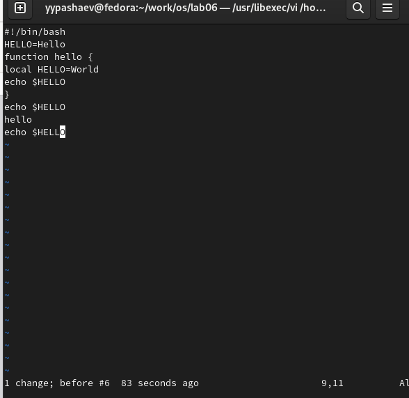
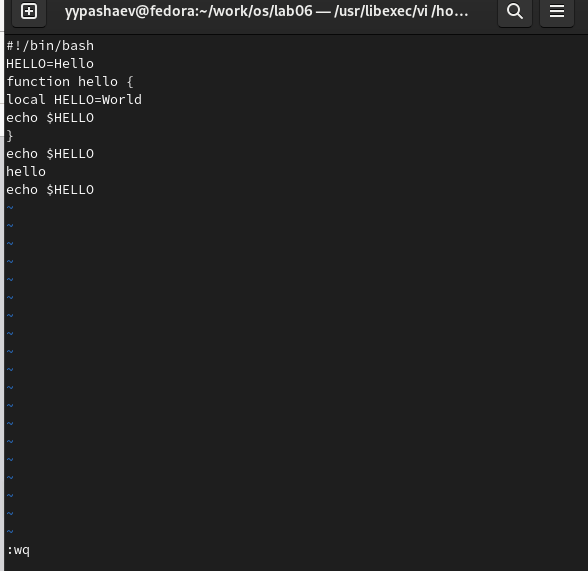

---
## Front matter
title: "Лабораторная работа №8"
subtitle: "Операционные системы"
author: "Пашаев Юсиф Юнусович"

## Generic otions
lang: ru-RU
toc-title: "Содержание"

## Bibliography
bibliography: bib/cite.bib
csl: pandoc/csl/gost-r-7-0-5-2008-numeric.csl

## Pdf output format
toc: true # Table of contents
toc-depth: 2
lof: true # List of figures
lot: true # List of tables
fontsize: 12pt
linestretch: 1.5
papersize: a4
documentclass: scrreprt
## I18n polyglossia
polyglossia-lang:
  name: russian
  options:
	- spelling=modern
	- babelshorthands=true
polyglossia-otherlangs:
  name: english
## I18n babel
babel-lang: russian
babel-otherlangs: english
## Fonts
mainfont: PT Serif
romanfont: PT Serif
sansfont: PT Sans
monofont: PT Mono
mainfontoptions: Ligatures=TeX
romanfontoptions: Ligatures=TeX
sansfontoptions: Ligatures=TeX,Scale=MatchLowercase
monofontoptions: Scale=MatchLowercase,Scale=0.9
## Biblatex
biblatex: true
biblio-style: "gost-numeric"
biblatexoptions:
  - parentracker=true
  - backend=biber
  - hyperref=auto
  - language=auto
  - autolang=other*
  - citestyle=gost-numeric
## Pandoc-crossref LaTeX customization
figureTitle: "Рис."
tableTitle: "Таблица"
listingTitle: "Листинг"
lofTitle: "Список иллюстраций"
lotTitle: "Список таблиц"
lolTitle: "Листинги"
## Misc options
indent: true
header-includes:
  - \usepackage{indentfirst}
  - \usepackage{float} # keep figures where there are in the text
  - \floatplacement{figure}{H} # keep figures where there are in the text
---

# Цель работы

Познакомиться с операционной системой Linux. Получить практические навыки рабо-
ты с редактором vi, установленным по умолчанию практически во всех дистрибутивах.

# Выполнение лабораторной работы

1. Создаю каталог с именем ~/work/os/lab06. Перехожу во вновь созданный каталог (рис. @fig:001).

{#fig:001 width=90%}

2. Вызовите vi и создайте файл hello.sh (рис. @fig:002).

{#fig:002 width=90%}

3. Нажал клавишу i и ввел следующий текст (рис. @fig:003)

{#fig:003 width=90%}

4.Сделаю файл исполняемым (рис. @fig:004)

{#fig:004 width=90%}

5. Вызову vi на редактирование файла (рис. @fig:005)

{#fig:005 width=90%}

6. Установлю курсор в конец слова HELL второй строки ,перейду в режим вставки и заменю на HELLO. нажму Esc для возврата в командный режим(рис. @fig:006)

{#fig:006 width=90%} 

7. Установлю курсор на четвертую строку и сотру слово LOCAL (рис. @fig:007)

{#fig:007 width=90%} 

8. Установлю курсор на последней строке файла. Вставлю после неё строку,содержащую следующий текст: echo $HELLO (рис. @fig:008)

{#fig:008 width=90%} 

9. Удалите последнюю строку.ВведУ команду отмены изменений u для отмены последней команды.(рис. @fig:009)

{#fig:009 width=90%} 

10. Введу символ : для перехода в режим последней строки. Запишу произведённые
изменения и выйдите из vi (рис. @fig:010)

{#fig:010 width=90%}

# Выводы

Познакомился с операционной системой Linux. Получил практические навыки рабо-
ты с редактором vi, установленным по умолчанию практически во всех дистрибутивах

# Список литературы{.unnumbered}

::: {#refs}
:::
