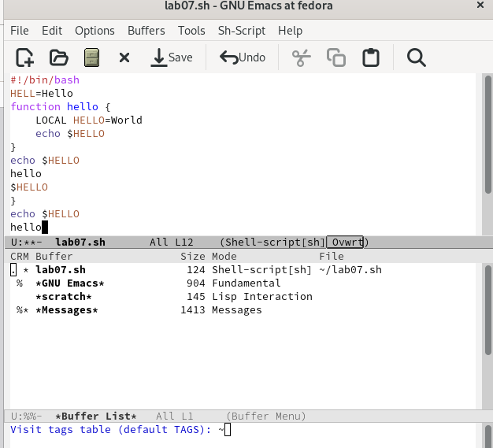

---
## Front matter
lang: ru-RU
title: Лабораторная работа №9
subtitle: Операционные системы
author:
  - Пашаев Юсиф Юнусович
institute:
  - Российский университет дружбы народов, Москва, Россия
 

## i18n babel
babel-lang: russian
babel-otherlangs: english

## Formatting pdf
toc: false
toc-title: Содержание
slide_level: 2
aspectratio: 169
section-titles: true
theme: metropolis
header-includes:
 - \metroset{progressbar=frametitle,sectionpage=progressbar,numbering=fraction}
 - '\makeatletter'
 - '\beamer@ignorenonframefalse'
 - '\makeatother'
---

# Информация

## Докладчик

:::::::::::::: {.columns align=center}
::: {.column width="70%"}

  * Юсиф Пашаев Юнусович
  * студент НБИбд-02-22
  * Российский университет дружбы народов
 

:::
::::::::::::::

# Вводная часть

## Материалы и методы

- Процессор `pandoc` для входного формата Markdown
- Результирующие форматы
	- `pdf`
	- `html`
- Автоматизация процесса создания: `Makefile`

# Создание презентации

## Процессор `pandoc`

- Pandoc: преобразователь текстовых файлов
- Сайт: <https://pandoc.org/>
- Репозиторий: <https://github.com/jgm/pandoc>

## Формат `pdf`

- Использование LaTeX
- Пакет для презентации: [beamer](https://ctan.org/pkg/beamer)
- Тема оформления: `metropolis`

## Код для формата `pdf`

```yaml
slide_level: 2
aspectratio: 169
section-titles: true
theme: metropolis
```

## Формат `html`

- Используется фреймворк [reveal.js](https://revealjs.com/)
- Используется [тема](https://revealjs.com/themes/) `beige`

## Код для формата `html`

- Тема задаётся в файле `Makefile`

```make
REVEALJS_THEME = beige 
```
# Результаты


# Элементы презентации

## Цели и задачи

- Познакомиться с операционной системой Linux. Получить практические навыки работы с редактором Emacs


## Содержание исследования

1. Открываю emacs.

{#fig:001 width=90%}

##

{#fig:002 width=90%}

##

2. Cоздаю файл lab07.sh с помощью комбинации Ctrl-x Ctrl-f (C-x C-f). 

{#fig:003 width=90%}

##

3. Наберу текст .

{#fig:004 width=90%}

##

4. Проделаю с текстом стандартные процедуры редактирования, каждое действие должно осуществляться комбинацией клавиш.
1.Вырежу одной командой целую строку (С-k).
2.Вставлю эту строку в конец файла (C-y).
3.Выделю область текста (C-space).
4.Вставлю область в конец файла.
5.Вновь выделю эту область и на этот раз вырежу её (C-w).
6 Отменю последнее действие (C-/)

{#fig:005 width=90%}

##

{#fig:006 width=90%}

##

{#fig:007 width=90%}

##

{#fig:008 width=90%}

##

{#fig:009 width=90%}

##

{#fig:010 width=90%}

##

5. Научусь использовать команды по перемещению курсора.
1.Переместить курсор в начало строки (C-a).
2.Переместить курсор в конец строки (C-e).

{#fig:011 width=90%}

##

{#fig:012 width=90%}

##

6. Управление буферами. Выведу список активных буферов на экран (C-x C-b) .

{#fig:013 width=90%}

##

7. Управление окнами.
 1.Поделю фрейм на 4 части: разделю фрейм на два окна по вертикали (C-x 3),
 а затем каждое из этих окон на две части по горизонтали (C-x 2)
 2.В каждом из четырёх созданных окон открою новый буфер (файл) и введите
 несколько строк текста.

{#fig:014 width=90%}

##

{#fig:015 width=90%}

##

8. Режим поиска. Переключюсь в режим поиска (C-s) и найду несколько слов, присутствующих в тексте .

{#fig:016 width=90%}

##

## Результаты

Познакомился с операционной системой Linux. Получил практические навыки работы с редактором Emacs.


## Итоговый слайд

- Запоминается последняя фраза. © Штирлиц

:::

