---
## Front matter
title: "Лабораторная работа №9"
subtitle: "Операционные системы"
author: "Пашаев Юсиф Юнусович"

## Generic otions
lang: ru-RU
toc-title: "Содержание"

## Bibliography
bibliography: bib/cite.bib
csl: pandoc/csl/gost-r-7-0-5-2008-numeric.csl

## Pdf output format
toc: true # Table of contents
toc-depth: 2
lof: true # List of figures
lot: true # List of tables
fontsize: 12pt
linestretch: 1.5
papersize: a4
documentclass: scrreprt
## I18n polyglossia
polyglossia-lang:
  name: russian
  options:
	- spelling=modern
	- babelshorthands=true
polyglossia-otherlangs:
  name: english
## I18n babel
babel-lang: russian
babel-otherlangs: english
## Fonts
mainfont: PT Serif
romanfont: PT Serif
sansfont: PT Sans
monofont: PT Mono
mainfontoptions: Ligatures=TeX
romanfontoptions: Ligatures=TeX
sansfontoptions: Ligatures=TeX,Scale=MatchLowercase
monofontoptions: Scale=MatchLowercase,Scale=0.9
## Biblatex
biblatex: true
biblio-style: "gost-numeric"
biblatexoptions:
  - parentracker=true
  - backend=biber
  - hyperref=auto
  - language=auto
  - autolang=other*
  - citestyle=gost-numeric
## Pandoc-crossref LaTeX customization
figureTitle: "Рис."
tableTitle: "Таблица"
listingTitle: "Листинг"
lofTitle: "Список иллюстраций"
lotTitle: "Список таблиц"
lolTitle: "Листинги"
## Misc options
indent: true
header-includes:
  - \usepackage{indentfirst}
  - \usepackage{float} # keep figures where there are in the text
  - \floatplacement{figure}{H} # keep figures where there are in the text
---

# Цель работы

Познакомиться с операционной системой Linux. Получить практические навыки рабо-
ты с редактором Emacs.

# Выполнение лабораторной работы

1. Открываю emacs.

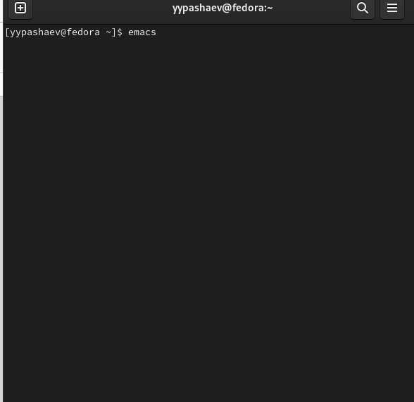{#fig:001 width=90%}

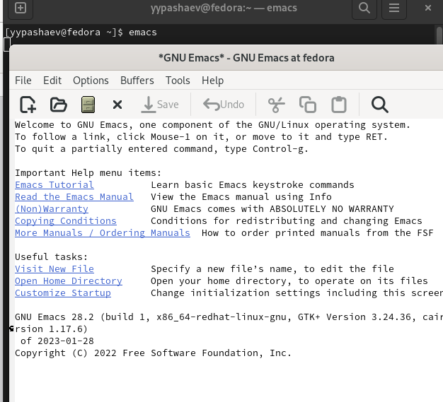{#fig:002 width=90%}

2. Cоздаю файл lab07.sh с помощью комбинации Ctrl-x Ctrl-f (C-x C-f). .(рис. @fig:003).

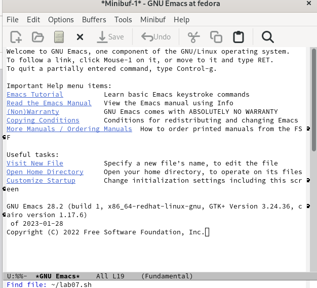{#fig:003 width=90%}

3. Наберу текст (рис. @fig:004).

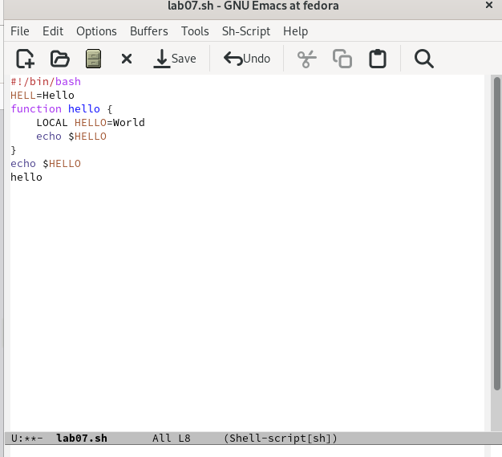{#fig:004 width=90%}

4. Проделаю с текстом стандартные процедуры редактирования, каждое действие должно осуществляться комбинацией клавиш.
1.Вырежу одной командой целую строку (С-k).
2.Вставлю эту строку в конец файла (C-y).
3.Выделю область текста (C-space).
4.Вставлю область в конец файла.
5.Вновь выделю эту область и на этот раз вырежу её (C-w).
6 Отменю последнее действие (C-/)

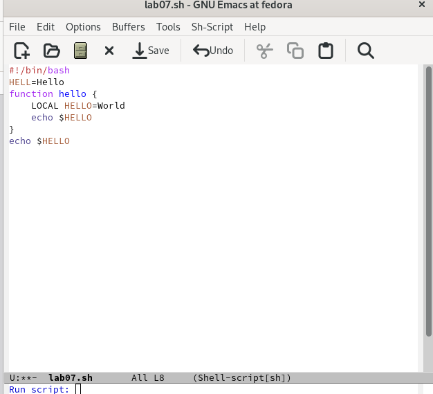{#fig:005 width=90%}

{#fig:006 width=90%}

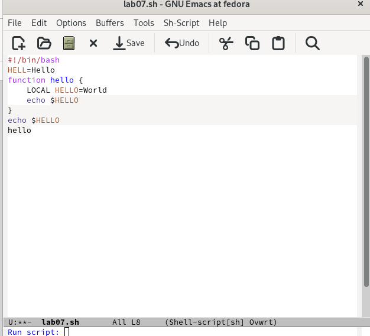{#fig:007 width=90%}

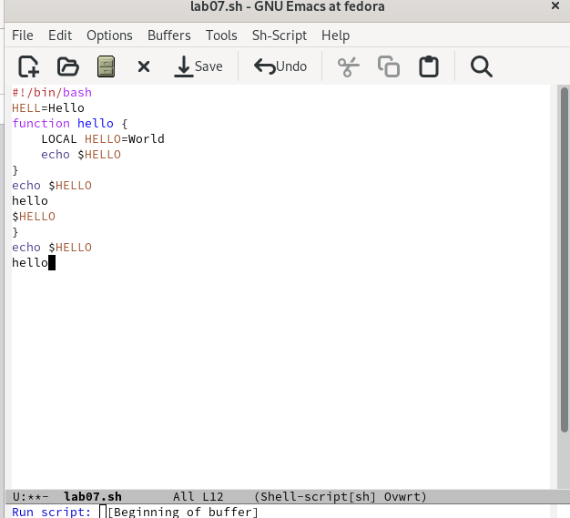{#fig:008 width=90%}

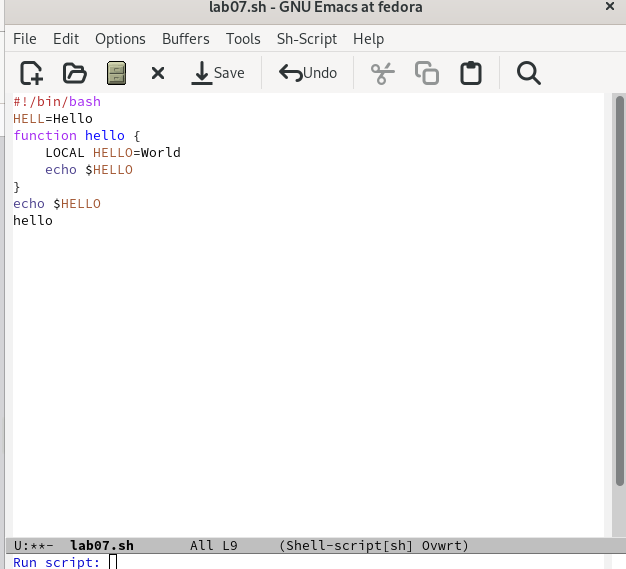{#fig:009 width=90%}

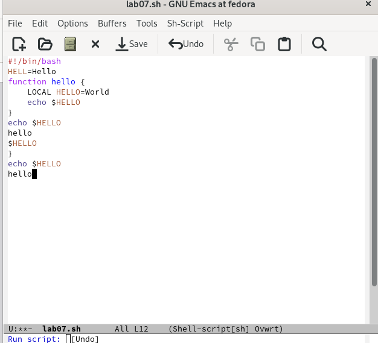{#fig:010 width=90%}

5. Научусь использовать команды по перемещению курсора.
1.Переместить курсор в начало строки (C-a).
2.Переместить курсор в конец строки (C-e).

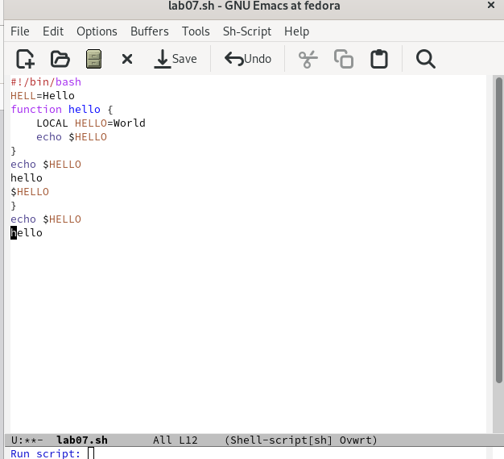{#fig:011 width=90%}

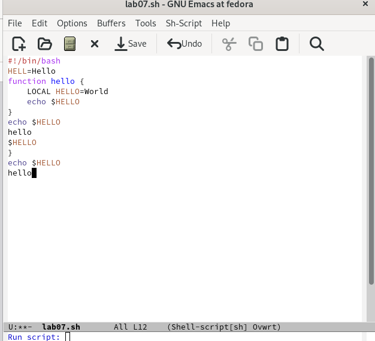{#fig:012 width=90%}

6. Управление буферами. Выведу список активных буферов на экран (C-x C-b) (рис. @fig:013).

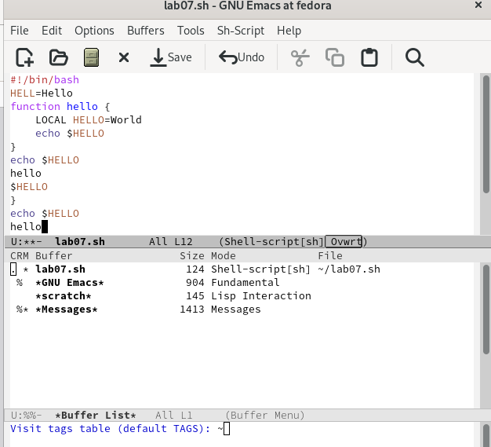{#fig:013 width=90%}

7. Управление окнами.
 1.Поделю фрейм на 4 части: разделю фрейм на два окна по вертикали (C-x 3),
 а затем каждое из этих окон на две части по горизонтали (C-x 2)
 2.В каждом из четырёх созданных окон открою новый буфер (файл) и введите
 несколько строк текста.

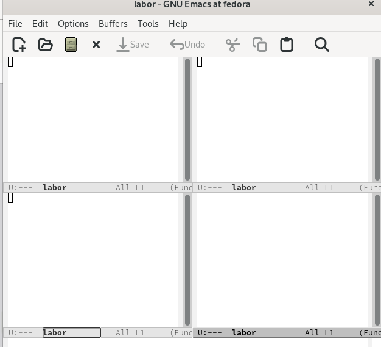{#fig:014 width=90%}

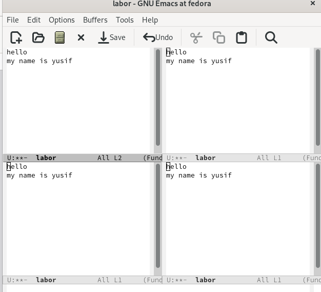{#fig:015 width=90%}

8. Режим поиска. Переключюсь в режим поиска (C-s) и найду несколько слов, присутствующих в тексте (рис. @fig:016).

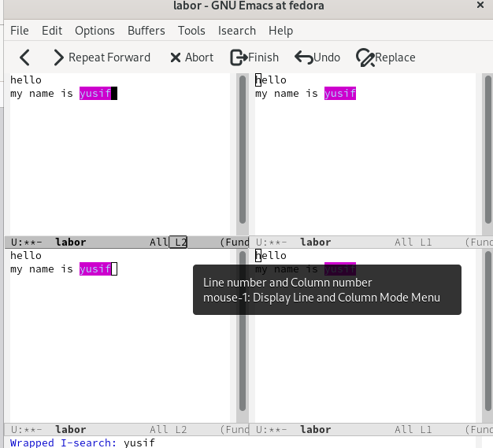{#fig:016 width=90%}

# Выводы

Познакомился с операционной системой Linux. Получил практические навыки работы с редактором Emacs.

# Контрольные вопросы
Контрольные вопросы:
1. Кратко охарактеризуйте редактор emacs. Ответ: Emacs представляет собой
мощный экранный редактор текста, написанный на языке высокого уровня
Elisp.
2. Какие особенности данного редактора могут сделать его сложным для осво-
ения новичком? Ответ: Сложным освоение данной программы для новичка
может сделать незнание комбинации клавиш или английского.
3. Своими словами опишите, что такое буфер и окно в терминологии emacs’а
Ответ: Моими словами буфер это динамическая память, а окно- то, что мы
видим
4. Можно ли открыть больше 10 буферов в одном окне? Ответ: Можно если
нет ограничений на систему.
5. Какие буферы создаются по умолчанию при запуске emacs? Ответ: Буферы,
которые открываются по умолчанию: GNU Emacs, scratch, Messages, Quail
Completions
6. Какие клавиши вы нажмёте, чтобы ввести следующую комбинацию C-c | и
C-c C-|? Ответ: Сtrl+c, Shift+ и Ctrl+c Ctrl+
7. . Как поделить текущее окно на две части? Ответ: Нажать C-x 3, или C-x 2.
8. В каком файле хранятся настройки редактора emacs? Ответ: Настройки
хранятся в файле ~/.emacs.
9. Какую функцию выполняет клавиша Backspace и можно ли её переназна-
чить? Ответ: Перемещение курсора
10. Какой редактор вам показался удобнее в работе vi или emacs? Поясните
почему. Ответ: Редактор emacs ,потому что на нем можно работать сразу с
несколькими файлами

# Список литературы{.unnumbered}

::: {#refs}
:::
