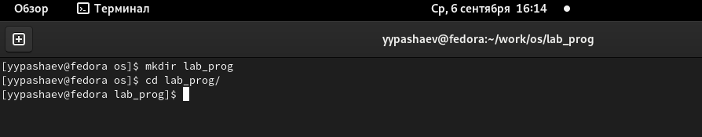
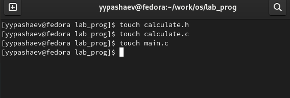
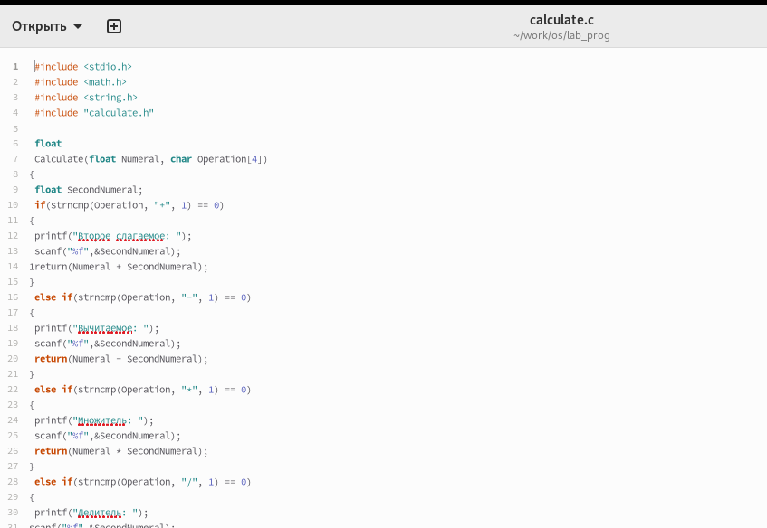
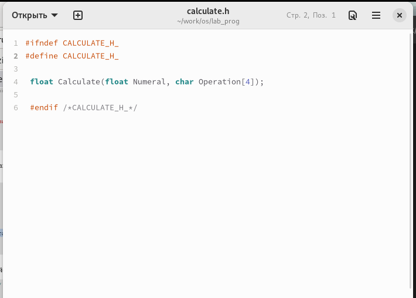
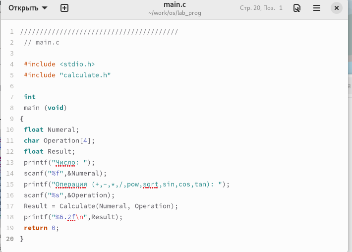
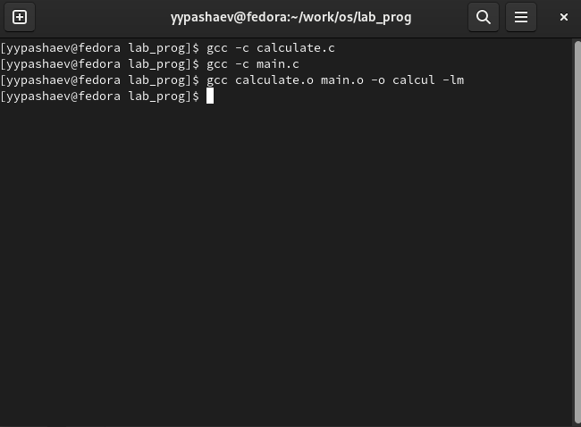
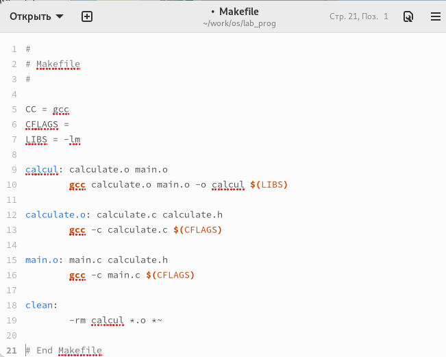
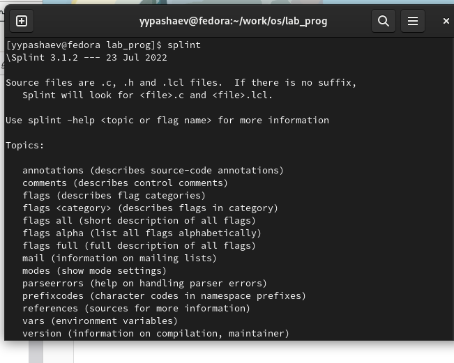

---
## Front matter
title: "Лабораторная работа №13"
subtitle: "Операционные системы"
author: "Пашаев Юсиф Юнусович"

## Generic otions
lang: ru-RU
toc-title: "Содержание"

## Bibliography
bibliography: bib/cite.bib
csl: pandoc/csl/gost-r-7-0-5-2008-numeric.csl

## Pdf output format
toc: true # Table of contents
toc-depth: 2
lof: true # List of figures
lot: true # List of tables
fontsize: 12pt
linestretch: 1.5
papersize: a4
documentclass: scrreprt
## I18n polyglossia
polyglossia-lang:
  name: russian
  options:
	- spelling=modern
	- babelshorthands=true
polyglossia-otherlangs:
  name: english
## I18n babel
babel-lang: russian
babel-otherlangs: english
## Fonts
mainfont: PT Serif
romanfont: PT Serif
sansfont: PT Sans
monofont: PT Mono
mainfontoptions: Ligatures=TeX
romanfontoptions: Ligatures=TeX
sansfontoptions: Ligatures=TeX,Scale=MatchLowercase
monofontoptions: Scale=MatchLowercase,Scale=0.9
## Biblatex
biblatex: true
biblio-style: "gost-numeric"
biblatexoptions:
  - parentracker=true
  - backend=biber
  - hyperref=auto
  - language=auto
  - autolang=other*
  - citestyle=gost-numeric
## Pandoc-crossref LaTeX customization
figureTitle: "Рис."
tableTitle: "Таблица"
listingTitle: "Листинг"
lofTitle: "Список иллюстраций"
lotTitle: "Список таблиц"
lolTitle: "Листинги"
## Misc options
indent: true
header-includes:
  - \usepackage{indentfirst}
  - \usepackage{float} # keep figures where there are in the text
  - \floatplacement{figure}{H} # keep figures where there are in the text
---

# Цель работы

Приобрести простейшие навыки разработки, анализа, тестирования и отладки при-
ложений в ОС типа UNIX/Linux на примере создания на языке программирования
С калькулятора с простейшими функциями.

# Выполнение лабораторной работы

1.  В домашнем каталоге создам подкаталог ~/work/os/lab_prog.(рис. @fig:001).

{#fig:001 width=90%}

2. Cоздаv в нём файлы: calculate.h, calculate.c, main.c.Это будет примитивнейший калькулятор, способный складывать, вычитать, умножать и делить, возводить число в степень, брать квадратный корень, вычислять sin, cos, tan.При запуске он будет запрашивать первое число, операцию, второе число. После этого программа выведет результат и остановится.

{#fig:002 width=90%}

{#fig:003 width=90%}

{#fig:004 width=90%}

{#fig:005 width=90%}

3. Выполним компиляцию программы посредством gcc  (рис. @fig:006)

{#fig:006 width=90%}

4. Создам Makefile со следующим содержанием (рис. @fig:007)

{#fig:007 width=90%}

5. С помощью утилиты splint попробуем проанализировать коды файлов calculate.c
и main.c (рис. @fig:008)

{#fig:008 width=90%}

# Выводы

Приобрел простейшие навыки разработки, анализа, тестирования и отладки при-
ложений в ОС типа UNIX/Linux на примере создания на языке программирования
С калькулятора с простейшими функциями

# Список литературы{.unnumbered}

::: {#refs}
:::
